# Toronto Dispatch

A north-up, top-down pixel-art courier game for ModRetro Chromatic / Game Boy Color. Drive, brake into corners, park, walk, run, swim and take timed transit through four compressed Toronto areas and selected Island routes.

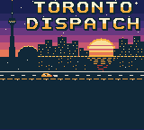 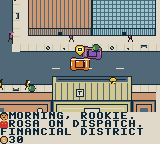 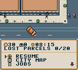 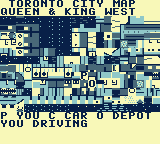

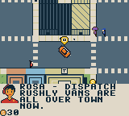 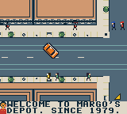 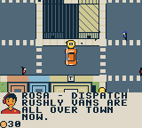 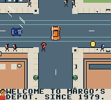

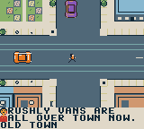 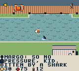 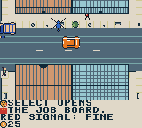 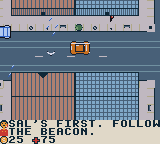 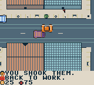 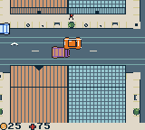

Overhaul, 2026-10-10: the city drawn at double scale in sixteen scenes (blocks several screens across, 16 px sidewalks), heavier and slower driving with tail slides and clipping contacts, A and B together to get out, cars that keep their size through a turn, running, swimming with sharks, projectile combat where both sides can miss, police cruisers, SUVs, unmarked cars and a helicopter, weather (rain, cloud and shadow, sun rays) with gulls, a two-row radio strip, a full-screen title, smaller menus and four new songs. Unmodified PyBoy frames from the candidate build (SHA-256 `2189d60d…`; the "before" frames are the main build `b105ba2a…`), staged by writing positions, stars or the clock in emulator memory; [provenance](docs/screenshots/provenance.json).

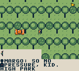 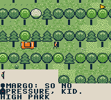 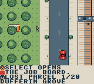 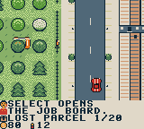

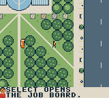 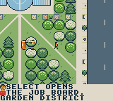 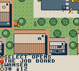 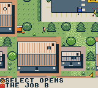

Greenery, 2026-10-10: a second green palette (pale lime and yellow-green beside the park greens), tree species by place (maples, honey locusts, lindens, tiered spruces, white blossom, willows by the water), front-yard hedges and white pickets, iron railings round parks, flower beds by shops, bushes beside buildings and along park paths, and clover, long grass and wildflowers on the lawns. All decoration: collision, routes and the map are unchanged, and the frame rate is the same. Unmodified PyBoy frames at 12:41 on a clear day from the candidate build (SHA-256 `06909a78…`); "before" frames are the main build `0a925319…`; [provenance](docs/screenshots/provenance.json).

**Status: Prototype 7 candidate.** The native game contains sixteen linked scenes (four districts at double scale), four vehicles, 88 authored contracts, the downtown street plan from the City of Toronto Centreline, moving pedestrians and traffic, paid scheduled subway/bus/ferry travel, a scrollable city atlas, original music/effects, and SRAM progression. Roads have 48 pixels of asphalt plus sidewalks. Prototype 4's native tests completed nine distinct jobs and kept the car moving through the previously stopping turn while acceleration stayed held. Build-specific checks also cover walking/car entry, collision and roof occlusion, transit, timeout/retry, pause and reset recovery. The two-hour release target, full Old Toronto coverage, physical cartridge testing and further handling polish remain open.

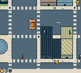 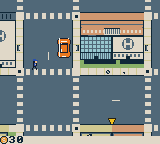 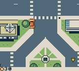 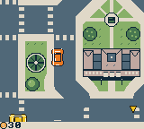

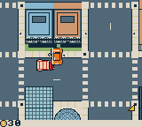 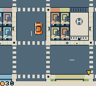 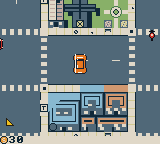 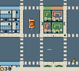

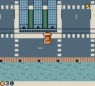 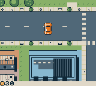 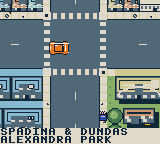 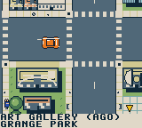

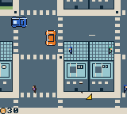  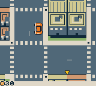 

Districts and navigation, 2026-10-07: the Financial District's black, gold and red granite towers; MaRS on College with Toronto General's helipad and Hospital Row; the ROM's Crystal and the Gardiner Museum across Queen's Park; Convocation Hall's dome at U of T; the King St theatres and Roy Thomson Hall; Chinatown's signboards beside Kensington's painted houses; St James Cathedral and its park; Little Portugal's blue houses and Little Italy's awnings; CityPlace and the Queens Quay boardwalk; Greektown on the Danforth. Sidewalks now have curbs, joints, lamps, street trees, benches and bike rings. Driving names each junction, landmark and neighbourhood ("SPADINA & DUNDAS", "ALEXANDRA PARK"). The last row compares the previous build. Unmodified PyBoy frames, staged by writing the car's position in emulator memory; [provenance](docs/screenshots/provenance.json).

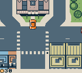 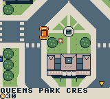 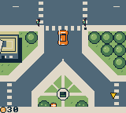 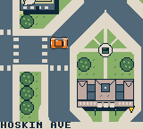

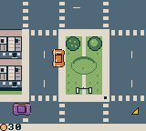 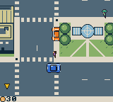 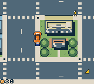 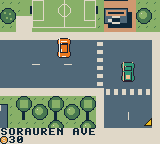

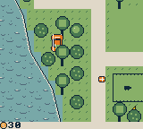 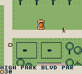 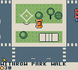 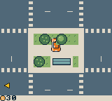

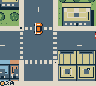  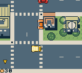 

Parks, 2026-10-07: Queen's Park as the ring of Queen's Park Crescent round the Legislative Building and the park with the King Edward VII statue (from the City Centreline, drawn about three times wider than true scale), a car crossing the crescent onto the lawn (flat ground is drivable everywhere), Trinity Bellwoods' gates and dog bowl, the Allan Gardens Palm House, The Grange, Sorauren Park's pitch and fieldhouse, Grenadier Pond, the High Park zoo's bison paddocks, Withrow Park's diamond and rink and Greenwood Park's pool. The last row compares the previous build. Unmodified PyBoy frames, staged by writing the car's position in emulator memory; [provenance](docs/screenshots/provenance.json).

   

   

   

   

Gameplay and scenery, 2026-10-07: animated ripple water in every scene, with foam and sand at the shore; the video screen at Yonge and Dundas; a spray bay (one in each area), which clears the stars for $25; one of the 20 lost parcels; the bays on The Queensway, Bloor St West and Queen St East, with Rosa's hint; and the lost-parcel count on the pause menu. The last row compares the previous build with this one. The previous build showed UI glyphs on the water and on some roofs, because the UI art overwrote part of the core tileset; that is fixed. Unmodified PyBoy frames, some staged by writing position, cash or stars in emulator memory; [provenance](docs/screenshots/provenance.json).

   

   

Story overhaul, 2026-10-07: Rosa's briefing, the client answering on delivery, a contract waiting for the story ("AFTER JOB 7"), Margo opening the second chapter, Dev of Rushly, Margo's answer to Vance, and Dev quitting Rushly and answering under the depot's card. Unmodified PyBoy frames; progress was staged by writing deliveries, completed contracts and the car's position in emulator memory, as listed in the [provenance](docs/screenshots/provenance.json).

   

Pop-up HUD, 2026-10-07: nothing covers the city until there is something to say. Unmodified PyBoy frames (one staged by writing the car's position); [provenance](docs/screenshots/provenance.json).

   

   

Development build, 2026-10-07: the downtown street plan from the City of Toronto Centreline with neighbourhood blocks and landmarks in place, the station prompt, the 501 pulling in, the ferry coming in over the harbour and the larger cars. Unmodified PyBoy frames (some staged by writing the courier's position in emulator memory); [provenance](docs/screenshots/provenance.json).

   

    

Development build: Rosa's radio calls, the pause menu and dispatch board as bottom sheets, a contract briefing with the distance readout, pistol lock-on and a long tracer round, a damaged car smoking and a stolen blue car with its own headlamp beam at night. Some frames are staged by writing car damage, paint or the play clock in emulator memory, as listed in the [provenance](docs/screenshots/provenance.json).

 

   

   

Development build: title, driving camera and the pause clock; the day/night cycle (golden hour, dusk, night, dawn); tyre smoke, a pickup and a parcel popping up and the patrol car's light bar. PyBoy frames, unmodified; some are staged by writing the play clock or position in emulator memory, as listed in the [provenance](docs/screenshots/provenance.json).


Unmodified Prototype5 native emulator frame; [provenance](docs/screenshots/provenance.json).

## Play

Select `project/project.gbsproj` with the ModRetro Chromatic plugin and build the current source. Run the exact inspected output file returned by the plugin in its native emulator or official browser preview. Generated ROMs are intentionally excluded from Git. See [build instructions](docs/BUILD.md) for tested build identities.

Prototype5 adds a [city atlas](docs/CITY_MAP.md) with job, parked-car and booked-transit-stop focus. Its exact ROM repeats the held-turn regression and verifies map pause/resume and paid-ride reset; see [test evidence](TESTING.md). Ready-made prototype bundles are on the [GitHub releases page](https://github.com/trancethehuman/toronto-dispatch/releases). Follow the [loading instructions](docs/LOADING.md) for the supported development cartridge.

Current source adds eight original curb signs and a scheduled [501 Queen game service](docs/STREETCAR.md) through west, core and east. The source has 51 service points while preserving every existing client and all 88 contracts. The final native Queen candidate completed three paid cross-district rides, paused/mapped a paid trip, reset and recovered the car. Its separate legacy train/bus/ferry sample verifies that the courier arrives beside the parked car at Union and can walk away and re-enter it. The earlier blocked-arrival failure remains documented. These are sampled scenarios; see the [Prototype 6 milestone](https://github.com/trancethehuman/toronto-dispatch/releases/tag/v0.2.0-prototype.6) and [exact test record](TESTING.md).

| Action | Controls |
| --- | --- |
| Accelerate / coast | Hold A / release A |
| Steer the vehicle | Left / right; brake for tighter corners |
| Brake / reverse | B; keep holding near rest to reverse |
| Accept or deliver a package | Select opens dispatch, then A accepts; Select at a beacon while stopped collects/delivers |
| Pause menu | Start; up/down scroll four actions at a time, A chooses |
| Park and exit | Stop, then hold A+B, or pause → Park / recover car |
| Walk | D-pad; A near the parked car animates entry |
| On foot | D-pad walks and aims; A beside a road vehicle takes it, otherwise punches; B away from a stop fires at the locked-on target (red brackets), hold B to keep firing |
| Pickups | Walk or drive over cash, first aid or ammunition on the pavement |
| Transit | On foot, B at a station/terminal/platform; left/right chooses destination, A waits/boards |
| Change service | Up/down at Wellesley switches Line 1 / 94 bus |
| Scrollable city map | Pause → map; D-pad pans, A centres job / booked transit stop / depot; Select changes focus, B returns |
| Change vehicle / save | Pause menu; change vehicle while stopped without an active job |
| Repair | Pause → Supplies ($20) heals, adds ammunition and repairs the car |
| Sound | Pause → Audio; cycle full music/effects, effects only, or silent |

First job: accept contract 1 at the Union depot, press Select to collect, drive east along Front Street to St. Lawrence Market, brake and press Select to deliver. The marker and HUD identify the next waypoint. Pickup is the first of the displayed stops. The 72 original contracts, plus eight western and eight eastern jobs, have distinct routes/titles, brief instructions and nine progression chapters. Completion unlocks truck/transit jobs, passenger work and Island walking rounds. Dispatch selects the next eligible unfinished contract. Replays pay but do not increment unique completion twice.

Transit runs on a repeating **fictional game clock**, even without the player. Fares are 3 for subway, 2 for bus and 4 for ferry; Queen also costs 3. These are game credits, not real TTC prices. At a Queen sign, choose a destination; the menu shows eastbound/westbound, departure countdown and trip cost/time. Each direction repeats every 64 seconds with a two-second boarding window, and a ride takes four seconds per selected stop interval. Choosing the current stop cannot board. Waiting/riding uses mission time; menus and the map pause it. Heavy freight and passenger jobs require their road vehicle. Parking leaves that vehicle behind for recovery. Island ferries connect through the mainland, and ordinary cars cannot reach the Islands.

Driving retains momentum through steering and glancing curb contact. A bounded sideways adjustment helps clear narrow tile corners while accelerating; broad walls still stop the vehicle. Fragile crates take greater crash damage. Fast passenger turns reduce comfort, and base rewards scale with condition. Two alternating CRC-checked save records retain a previous checkpoint if a write is interrupted. Paid rides resume from their latest second after a reset. Physical power-off persistence still needs a cartridge test.

The campaign is an original story told over the radio: Margo's independent depot against Rushly, an app courier, for the city's Lakelight festival contract. Rosa briefs each contract, clients answer on delivery, plot turns follow the contracts they belong to, and each chapter opens once the previous chapter's key contract is done (the board shows "AFTER JOB n" until then). Police warnings and city chatter fill the quiet while play continues. The screen stays clear: short pop-ups at the bottom show the next stop, street names, ammunition after a shot, changes in cash, health or car condition, and the job timer when it matters; stand still to see the status line. The car wears from crashes, smokes and loses power until repaired. Pedestrians follow 620 fixed sidewalk routes across the four areas with eight nearby people rendered at a time, in six designs and four colours; road vehicles come in eight designs and seven paints. Traffic follows continuous loops, yields to the courier crossing on foot and keeps returning just beyond the screen edge so nearby streets stay busy. Crimes draw police attention in stars; the police chase without overwhelming speed, arrests need a firm hold and officers only shoot from four stars. Sidewalk pickups give cash, first aid or ammunition. The visible bus currently uses a truck-shaped placeholder and has a separate animation path from the boarding timetable. Dedicated TTC vehicle art and matching visible service schedules remain planned. Four original themes (title, day, night and police chase) switch with the game state; they, the engine, braking and event effects have been verified through emulator PCM capture; physical speaker/headphone testing remains open. See [audio design and reproduction](docs/AUDIO.md).

For installation, use the [loading instructions](docs/LOADING.md). ROM bundles require the [distribution notices](docs/DISTRIBUTION.md). This prototype has not been verified for two hours of gameplay.

## Source and scope

- [City map controls and implementation](docs/CITY_MAP.md).
- [Queen platforms, fictional timetable and transit research](docs/STREETCAR.md).
- [Design](DESIGN.md), [decisions](DECISIONS.md), [roadmap](ROADMAP.md) and [test evidence](TESTING.md).
- [Old Toronto research](docs/TORONTO_RESEARCH.md) and [geography boundaries](docs/GEOGRAPHY.md).
- [Proposed district expansion](docs/OLD_TORONTO_EXPANSION.md) and [runtime audit](docs/WORLD_RUNTIME_AUDIT.md).
- [Editable GB Studio project](project/project.gbsproj) and [native scene engine](project/plugins/toronto-driving/engine/).
- [Compiled campaign specification](content/campaign.json) and [original world/art specification](content/city_art.json).
- [Asset generators and collision/connectivity validator](scripts/).

The present city compresses central Toronto, Parkdale/Roncesvalles, High Park/Swansea/Junction and Riverside/Riverdale/Leslieville/western Danforth. Queen service uses eight shared directional platform pairs on the normal corridor with fictional operation; current construction detours are omitted and the map era remains unadopted. The wider historical municipality, neighbourhood detail, full 501, King 504 and full TTC network are future work. Landmark art is an original interpretation. The original three mission design samples remain in `content/missions.json`; runtime contracts are in `campaign.json`.

## Develop

1. Install the **ModRetro Chromatic** plugin and attach it to the development chat. Follow the [official DevDay quickstart](https://support.modretro.com/en_us/chromatic-devday-edition-quickstart-guid-By1iOlcMg).
2. Ask it to inspect existing dependencies and prepare missing ones for GB Studio, ROM builds and automated playtests.
3. Read [AGENTS.md](AGENTS.md), then the [design](DESIGN.md), [decisions](DECISIONS.md) and [roadmap](ROADMAP.md). Workflow skills are in [skills/](skills/), also discoverable through `.agents/skills`.
4. Select `project/project.gbsproj` with the plugin, build, and play the exact output in its emulator. Run the gameplay checks before preparing a cartridge build.

The game builds with GB Studio CLI 4.3.2 / GBDK 4.5.0 and runs in PyBoy 2.7.0; exact versions and commands are in [docs/BUILD.md](docs/BUILD.md).

## Repository checks

Use Python 3.10+, Make and a C compiler supporting AddressSanitizer/UBSan (Clang or GCC):

```sh
python3 -m pip install --requirement requirements-dev.txt
make check
```

This validates source references, campaign and text integration, PNG/palette/collision consistency, tile budgets, map-bank sizes, seam lanes, traffic and pedestrian paths and client connectivity; generator checks catch stale native headers. Behavioural fixtures run the real C engine with host hardware stubs (turning, curb contact, scene changes, clock gaps, interrupted saves). These checks do **not** compile or playtest a ROM. GitHub Actions runs the same checks.

## Playing on a cartridge

See the [loading instructions](docs/LOADING.md) and [hardware notes](docs/HARDWARE.md). The official workflow supports emulator play, streaming an emulator to a connected Chromatic, and writing a built ROM to the writable development cartridge; these are separate verification steps. Developer Mode activation is required for the DevDay cartridge; never commit or share the activation code. The current main build was written to the development cartridge on 2026-10-10; boot, play, save and audio checks on the console are pending ([testing record](TESTING.md)).

## Contributing and licence

See [CONTRIBUTING.md](CONTRIBUTING.md). Original code and artwork are MIT licensed ([LICENSE](LICENSE)). Starter font and metadata retain their upstream notices; external tools and data terms are in [THIRD_PARTY_NOTICES.md](THIRD_PARTY_NOTICES.md). No commercial courier branding, map imagery or TTC logo is included.

This is an independent homebrew project, with no affiliation with ModRetro, Nintendo, Uber, the City of Toronto, or the TTC.
