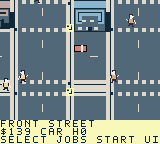

# ModRetro Games

Original open-source homebrew games for ModRetro Chromatic / Game Boy Color. Each game keeps its editable project, artwork, design and verification record in `games/<game-slug>/`.

| Game | Features | Current status |
| --- | --- | --- |
| [Toronto Dispatch](games/toronto-dispatch/) | North-up courier sandbox, six Toronto districts, 96 contracts, walking/driving and scheduled transit | Native prototype; current ROM passes first delivery, RESULT controls and save/reset checks. Full campaign, two enjoyable human hours and hardware remain pending. |

Toronto Dispatch contains 241 buildings, 595 pedestrian routes, 59 service points, seven parking anchors and four player vehicles. Explore compressed mainland neighbourhoods, Port Lands industry/bridges and public walking Islands. Momentum/braking, pedestrians and police consequences, scheduled train/bus/Queen/ferry travel, a scrollable atlas, original audio and save v9 progression are implemented.

 

Unmodified sampled Core emulator frames 632 and 560 on current `a0bd…`; [provenance](games/toronto-dispatch/docs/screenshots/result-controls-provenance.json).

## Play or load

Read the [controls and features](games/toronto-dispatch/README.md) and [Chromatic loading guide](games/toronto-dispatch/docs/LOADING.md). Current local ROM is `toronto-dispatch-result-controls.gbc`, 524,288 bytes, SHA-256 `a0bd037ac8925534e40d5147ae8ae4f748e533462bd0c01502ae5004648ae634`. RESULT B closes the receipt without reversing while held; release and press B again to brake/reverse normally.

This exact ROM has scoped fresh first-delivery/control/reset evidence. Earlier `d58…` bus, heat, patrol and six-job continuation records, and `7b2…`'s 13-job Island campaign, retain their own identities in [TESTING.md](games/toronto-dispatch/TESTING.md). All 96 played contracts, fuller Old Toronto, two measured enjoyable human hours, wider pacing/vehicles, browser recovery and physical stream/flash/cold-boot/save persistence remain unverified. No hardware installation is claimed; [published Prototype 6](https://github.com/trancethehuman/modretro-games/releases/tag/v0.2.0-prototype.6) is a separate older release.

## Develop

Install the ModRetro Chromatic plugin, read [AGENTS.md](AGENTS.md) and the game's design/decisions/roadmap, then select `games/toronto-dispatch/project/project.gbsproj`. Follow [native build instructions](games/toronto-dispatch/docs/BUILD.md). Shared workflows live in [skills/](skills/), also exposed at `.agents/skills`.

```sh
python3 -m pip install --requirement requirements-dev.txt
make check
```

Repository checks validate sources and host engine behavior; native builds, emulator play and physical cartridge checks are separate evidence. Add new games under `games/<game-slug>/`; see [CONTRIBUTING.md](CONTRIBUTING.md).

Original code/art are [MIT licensed](LICENSE); [third-party notices](THIRD_PARTY_NOTICES.md) preserve upstream terms. This independent project is unaffiliated with ModRetro, Nintendo, Uber, the City or TTC.
