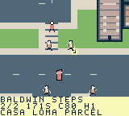
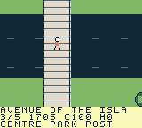

# ModRetro Games

Original open-source homebrew games for ModRetro Chromatic / Game Boy Color. Each game keeps its editable project, artwork, design and verification record in `games/<game-slug>/`.

| Game | Features | Status |
| --- | --- | --- |
| [Toronto Dispatch](games/toronto-dispatch/) | North-up courier sandbox, seven compressed Toronto districts, 104 contracts, walking/driving and scheduled transit | Working 8be1 cartridge; tested 9c155 update adds slower driving/trams, four smaller pedestrian types, impacts, simpler menus and richer scenery. New hardware/balance review remains open. |

## Toronto Dispatch

Deliver packages, fragile art, freight and passengers through Toronto-inspired streets. Drive a car, truck, motorcycle or scooter with momentum and braking; park to walk to clients, or pay for scheduled trains, buses, Queen streetcars and ferries. Explore mainland neighbourhoods, Port Lands bridges, public Islands and Uptown Hills using a scrollable city atlas.

The city contains 344 original buildings, 657 pedestrian routes, 64 service points and nine mainland parking anchors. Commuters, workers, backpackers and seniors walk nearby. Road traffic follows fictional signals; pedestrian impacts show non-graphic airborne/prone poses and escalate police consequences. The walking courier can be struck and recover. Original roof details, signs, benches and planters enrich the streets; planes, helicopters and boats add movement. Paid transit uses fictional fares and timetables.

 

Original 160 × 144 frames from the retained `7ab28…` ROM, at frames 63,970 and 82,748 in separate native continuations. Exact provenance is in the [North](games/toronto-dispatch/docs/NATIVE_NORTH_CURRENT_CONTINUATION.json) and [relay/Island](games/toronto-dispatch/docs/NATIVE_RELAY_ISLAND_CURRENT_CONTINUATION.json) records.

Read the [game guide and controls](games/toronto-dispatch/README.md) and [Chromatic loading instructions](games/toronto-dispatch/docs/LOADING.md). The selected 1 MiB update `toronto-dispatch-hardware-feedback.gbc` has SHA-256 `9c155a70c0cc3d6ccec986fc0ab7ddc3a204fd04e80879ad0233926156d4b10e`. Generated binaries stay outside Git; the installed 8be1 ROM and all earlier bundles remain preserved separately.

Official compilation and repository checks pass. The [fresh update record](games/toronto-dispatch/docs/NATIVE_HARDWARE_FEEDBACK.json) completes the first delivery at full condition, checks cardinal driving, walking/entry, human impacts, menus/map freeze, scheduled Queen travel, tram injury/recovery and saved in-worker reset. [Update details](games/toronto-dispatch/docs/HARDWARE_FEEDBACK_2026_10_04.md) separate those samples from prior 7ab sixteen-job evidence. The user confirmed the older 8be1 cartridge boots and plays; this new update has not been flashed. Full 104-contract play, two enjoyable measured human hours, slower-speed balance, broader performance/stack and physical update/save/audio/flicker checks remain pending.

## Develop

Install the ModRetro Chromatic plugin, read [AGENTS.md](AGENTS.md) and the game's design, decisions and roadmap, then select `games/toronto-dispatch/project/project.gbsproj`. Follow the [native build instructions](games/toronto-dispatch/docs/BUILD.md). Shared workflows live in [skills/](skills/), also exposed at `.agents/skills`.

```sh
python3 -m pip install --requirement requirements-dev.txt
make check
```

Repository checks validate sources and host engine behavior; native builds, emulator play and physical cartridge checks are separate evidence. Add new games under `games/<game-slug>/`; see [CONTRIBUTING.md](CONTRIBUTING.md).

Original code/art are [MIT licensed](LICENSE); [third-party notices](THIRD_PARTY_NOTICES.md) preserve upstream terms. This independent project is unaffiliated with ModRetro, Nintendo, Uber, the City or TTC.
