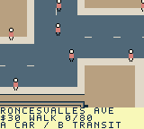
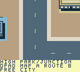

# ModRetro Games

An open-source collection of original games for ModRetro Chromatic and Game Boy Color. Every game has its own folder, editable source, design notes, and build/testing record.

## Games

| Game | Idea | Status |
| --- | --- | --- |
| [Toronto Dispatch](games/toronto-dispatch/) | A top-down Toronto courier game with timed jobs, momentum, braking, pedestrians and scheduled transit | Six-scene ROM with scoped Island exploration/ferry/reset passes; 96 preserved contracts; broader campaign/hardware pending; Prototype 6 separate |

## Start developing

1. Install the **ModRetro Chromatic** plugin from the Codex Plugins tab and attach it to the development chat. Follow the [official DevDay quickstart](https://support.modretro.com/en_us/chromatic-devday-edition-quickstart-guid-By1iOlcMg).
2. Ask it to inspect existing dependencies and prepare missing dependencies for GB Studio creation, ROM builds, and automated playtests.
3. Read [AGENTS.md](AGENTS.md) and the game's design, decisions, and roadmap. Local workflow skills are in [skills/](skills/), with Codex discovery through `.agents/skills`.
4. Select `games/toronto-dispatch/project/project.gbsproj` using the plugin. It is a genuine editable project created by the plugin; each additional game gets its own project folder.
5. Build and open the same playable emulator preview during iteration. Audit assets and run gameplay checks before preparing a cartridge build.

Toronto Dispatch builds with GB Studio CLI 4.3.2 / GBDK 4.5.0 and runs in PyBoy 2.7.0. Published Prototype 3 links compressed central Toronto, Parkdale/Roncesvalles and High Park/Swansea/Junction, with 80 contracts, 35 service points, 166 buildings and four vehicles. Walking/car entry, momentum and braking, wide roads, collision/roof occlusion, core paid transit, original audio and saved progression are part of that prototype.

Prototype 4 adds Riverside/Riverdale/Leslieville and the western Danforth. Each scene is 1,024 × 976 pixels, in a logical 4,096 × 976 atlas. It compiles 211 buildings, 486 fixed pedestrian routes with six nearby walkers in the loaded district, 18 traffic loops across the three added scenes and 14 reciprocal seam pairs. Eight eastern jobs and eight clients bring the campaign to 88 contracts/43 service points, including short Withrow and Greenwood park handoffs. Banked world data guides the beacon toward the next district; drivers see legal parking approaches for foot-only clients, then the actual handoff point when walking. The core transit selector displays the shared departure window. The exact ROM and loading bundle are identified by [Prototype 4](https://github.com/trancethehuman/modretro-games/releases/tag/v0.2.0-prototype.4).

On Prototype 4 (`1da71ba5…`), automated ordinary-button play completed nine distinct contracts, including car, truck, motorcycle and a Withrow park-and-walk relay. All four native scenes loaded; sampled travel covers the three core/east approaches, core-to-west driving and west-to-High Park walking. The Withrow marker changed from roadside parking to the client after exiting, car re-entry worked, a remote High Park reset restored nine completions and the parked car, and the local map scrolled while the player/clock stayed frozen. The held-acceleration turn retained speed 24. A separate paid subway sample boards immediately, charges once and arrives on foot while retaining the parked car. This is about eight minutes of purposeful native progression, not a full campaign or a human playtest.

Prototype5 adds a browsable native [city atlas](games/toronto-dispatch/docs/CITY_MAP.md), generated from the four registered collision grids. Pan across areas; focus the courier, vehicle, job, booked transit stop or Union depot. Native checks repeat the full-speed held-turn regression and verify paused job/WAIT/RIDE state, scene/camera/text restoration and paid-ride reset. Its exact scope is separate from Prototype4's nine-job progression. See the [Prototype5 release](https://github.com/trancethehuman/modretro-games/releases/tag/v0.2.0-prototype.5) and [loading instructions](games/toronto-dispatch/docs/LOADING.md).

Published [Prototype 6](https://github.com/trancethehuman/modretro-games/releases/tag/v0.2.0-prototype.6) adds a [501 Queen game service](games/toronto-dispatch/docs/STREETCAR.md): eight shared curb platforms across west/core/east, a three-dollar fare, directional departures on a fictional 64-second period and four seconds per stop interval. It preserves the 88 contracts and 58-byte version-6 save format, bringing service points to 51. Its sampled native checks cover paid cross-district rides, pause/map/reset, parked-car recovery and legacy train/bus/ferry travel.

Newer source adds an original moving Queen streetcar with door poses and scene-following paid rides, plus occasional [plane and helicopter flybys](games/toronto-dispatch/docs/AIRCRAFT.md), rotor animation and separated shadows. Source also corrects overlapping traffic recovery, booked tram occupancy and unsafe alighting; the earlier exact `14005662…` replay covers paid reset, walking recovery, flybys and delivery/driving.

Retained Port Lands baseline **`a212dd9ed479310a98e58b701416f8af88aaa09174f186747dca678ff4c164f4`** appends original [Port Lands](games/toronto-dispatch/docs/PORT_LANDS_PLAN.md) industry, supported bridges, park paths and Cherry Beach as the fifth 1,024 × 976 scene. Only Leslie connects it to East. Its official resource/build gates and scoped native Queen travel, foot entry/return, Beach reset, map freezing, aircraft and first-delivery driving pass. That five-scene source totals 235 buildings, 565 pedestrian routes, 24 non-core traffic loops and 15 seam pairs, with a 512 × 244 city map.

The street source adds distinct civilians, escalating human-impact fines and local road police pursuits, six road vehicle kinds obeying fictional lights, and cosmetic boats clipped below existing decks. Its full-body terrain checks, 16-/four-VBlank ordinary/police motion and fused admission/guard/commit use an 87-byte transient snapshot without new persistent RAM. The retained street milestone uses save v8/58 bytes; current Islands source advances to v9 at the same size. Retained ROM **`a243834899097d9660190022f03ce31d322d2584d0d7cfe1fdf8adb84a8902ea`** passes its official build/resource/memory gates and full `make check`. Separate ordinary-control records verify H1 impact/stumble, map/attention reset, road police capture, parking/walking/blocked shore/visible boat and a full-condition first delivery. Pacing samples 108 updates/360 VBlanks, below the retained 132 baseline. A further [Port Lands driving record](games/toronto-dispatch/docs/NATIVE_PORT_DRIVING_SAMPLE.json) on that same ROM crosses all six decks by car, walks Commissioners, restores a Port walker/car after a real reset, reaches the true Beach water edge and returns to East. H2/H3 escalation is sampled with cash already zero; exact higher fines and escape remain unverified.

Retained candidate **`c625e6dce80a56a787c940885da5abd332fce47335e52f57698c3395a14ba364`**, `toronto-port-campaign-clock.gbc`, compiles **96 contracts/59 service points** with seven parking anchors and the original 88/51 native fields/briefs preserved. Full `make check` (699,955 engine checks), official build/header/compiled/memory gates pass. Its [ordinary-control replay](games/toronto-dispatch/docs/NATIVE_PORT_CAMPAIGN_SAMPLES.json) completes three original contracts, then Fire Hall Books through Riverside→Leslie→Port parking and a legal foot approach around the building. Delivery leaves condition 36 / cash 71 / done 4; a genuine reset restores the new completion/foot/Port car and re-entry works. This is one of eight new jobs; deadlines, other jobs and handling/reward balance remain unverified. Routes use only Leslie and existing rules; no 114 service is added. Stationary timing 110/360 versus retained fused 108 is a tiny scoped difference, not whole-city performance. Published Prototype 6 contains none of these later changes. [TESTING.md](games/toronto-dispatch/TESTING.md) separates exact native and physical evidence.

Retained five-scene candidate **`4343f2b858e62f9e8daa2a3576a1d06bb7ee7208d2cd4a55434c36e168fb3100`**, `toronto-dispatch-route-feedback.gbc`, adds full quest itinerary browsing and exact condition/base/time/credited-pay feedback. Up/down previews ordered stops and walking/return cues; left/right retains job selection. Full local checks pass, including 704,884 engine and 24,185,014 UI cases. Scoped native previews, first payment, timeout, reset and a separate paid Line 1 trip pass; [portable evidence](games/toronto-dispatch/docs/NATIVE_DISPATCH_UI_SAMPLES.json) keeps the scopes distinct. Identical tram progress tables improve a bounded stationary sequence from 348 to 381 updates over 1,080 VBlanks; crowded and handheld pacing remain open. The 58-byte save and 96 contracts are preserved.

Current source registers a sixth [Toronto Islands district](games/toronto-dispatch/docs/ISLAND_DISTRICT_PLAN.md): public walking paths, three existing footbridges, the three ferry landings and nine original buildings. Totals are **241 buildings, 595 pedestrian routes, 96 contracts and 59 service points**. Only six Island stop coordinates/districts move; all contract fields, completion IDs and seven mainland parking anchors stay pinned. Save v9 retains 58 bytes and migrates legitimate old Island checkpoints through an immutable historical terrain mask. Ferry guidance and an idle insufficient-cash return rule are integrated; road traffic stays disabled on the Islands. The corrected local candidate is **`7b2af59c27179bd3445c5c074b85fb4a029b50144ef27ed3095f9a3ce83f7d5a`**, `toronto-dispatch-islands-safe.gbc`. Its official build/compiled gates and full checks pass, including 787,948 engine, 25,107,699 UI and 510 campaign preservation regressions. A closed ordinary-input replay covers all three docks/clients/bridges, inland/coastal routes, blocked shore/private yards/airport gap, canopy occlusion, map focus/panning with all 58 game bytes frozen, v9/paid/free resets and mainland car recovery. Seven paid ferry legs reduce cash 30→2; scheduled return assistance costs zero and preserves cash 2. A first Core delivery then pays 109, leaving cash 111/done 1/condition 100. [Portable evidence](games/toronto-dispatch/docs/NATIVE_ISLAND_DISTRICT_SAMPLES.json) retains this scoped result. Native old-v8 imports and all nine Island missions/deadlines remain pending. The loading guide now selects this local candidate; published Prototype 6 remains separate.

The earlier six-scene `8a96…` replay failed when the pause AUDIO row’s mixed native `%c/%s` formatter overflowed its 40-byte buffer and corrupted cached map focus. The safe ROM uses bounded label assembly; all three audio labels leave that cache unchanged in its native replay. Earlier `4343…` and failure evidence keep their own identities.

Remaining seam lanes and jobs, truck/motorcycle/scooter bridge cases, occlusion and crowded-scene performance, full former-Toronto/fuller-Islands coverage, measured two-hour gameplay and physical cartridge checks remain pending. The Queen service is a representative normal-corridor game abstraction; current diversions, the full 501 route, King 504 and the wider TTC network are not implemented. Preview/browser state also needs confirmation. See [build instructions](games/toronto-dispatch/docs/BUILD.md), [build-specific evidence](games/toronto-dispatch/TESTING.md), [western geography](games/toronto-dispatch/docs/WEST_DISTRICT.md), [eastern geography](games/toronto-dispatch/docs/EAST_DISTRICT.md) and the broader [Old Toronto expansion proposal](games/toronto-dispatch/docs/OLD_TORONTO_EXPANSION.md). The proposed 2026 map era has not been adopted.


Unmodified Prototype5 emulator frame; [provenance](games/toronto-dispatch/docs/screenshots/provenance.json).

 

Unmodified emulator frames from published Prototype 3; [provenance](games/toronto-dispatch/docs/screenshots/provenance.json). They do not show the eastern expansion.

## Repository checks

Use Python 3.10+, Make and a C compiler supporting AddressSanitizer/UBSan (Clang or GCC):

```sh
python3 -m pip install --requirement requirements-dev.txt
make check
```

This validates source references, native campaign/text integration, registered PNG/palette/collision consistency, pixel tile budgets, map-bank sizes, reciprocal seam lanes, traffic/pedestrian paths and client connectivity. Generator checks detect stale native headers and route-planning snapshots. Behavioral fixtures use the real C engine with host hardware stubs, including turning, curb contact, scene changes, clock gaps and interrupted saves. These checks do **not** compile or playtest a ROM. GitHub Actions is configured to install pinned Pillow and run the same checks.

## Playing on a cartridge

See [Toronto Dispatch loading instructions](games/toronto-dispatch/docs/LOADING.md) and [docs/HARDWARE.md](docs/HARDWARE.md). The official workflow supports emulator preview, streaming an emulator to a connected Chromatic, and writing a built homebrew ROM to the writable development cartridge. These are separate verification steps. Developer Mode activation is required for the included DevDay cartridge; never commit or share the activation code.

A playable city ROM has been built and tested in the native emulator. No device stream or cartridge write has been attempted. Hardware testing will be recorded per game after the device and supported cartridge are connected.

## Contributing

See [CONTRIBUTING.md](CONTRIBUTING.md). Add new games under `games/<game-slug>/`; keep unrelated games independent. Original code and assets are MIT licensed. Starter artwork and upstream metadata retain their MIT notices. See [THIRD_PARTY_NOTICES.md](THIRD_PARTY_NOTICES.md) for external tools and data terms.

This is an independent homebrew project, with no affiliation with ModRetro, Nintendo, Uber, the City of Toronto, or the TTC.
