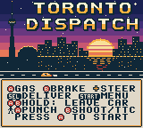
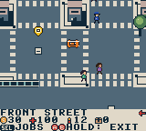
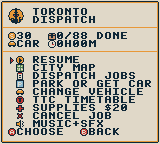

# ModRetro Games

An open-source collection of original games for ModRetro Chromatic and Game Boy Color. Every game has its own folder, editable source, design notes, and build/testing record.

## Games

| Game | Idea | Status |
| --- | --- | --- |
| [Toronto Dispatch](games/toronto-dispatch/) | A top-down Toronto courier game with timed jobs, momentum, braking, pedestrians and scheduled transit | Prototype 6 milestone: four districts, 88 contracts, city atlas and scheduled Queen travel |

## Start developing

1. Install the **ModRetro Chromatic** plugin from the Codex Plugins tab and attach it to the development chat. Follow the [official DevDay quickstart](https://support.modretro.com/en_us/chromatic-devday-edition-quickstart-guid-By1iOlcMg).
2. Ask it to inspect existing dependencies and prepare missing dependencies for GB Studio creation, ROM builds, and automated playtests.
3. Read [AGENTS.md](AGENTS.md) and the game's design, decisions, and roadmap. Local workflow skills are in [skills/](skills/), with Codex discovery through `.agents/skills`.
4. Select `games/toronto-dispatch/project/project.gbsproj` using the plugin. It is a genuine editable project created by the plugin; each additional game gets its own project folder.
5. Build and open the same playable emulator preview during iteration. Audit assets and run gameplay checks before preparing a cartridge build.

Toronto Dispatch builds with GB Studio CLI 4.3.2 / GBDK 4.5.0 and runs in PyBoy 2.7.0. Published Prototype 3 links compressed central Toronto, Parkdale/Roncesvalles and High Park/Swansea/Junction, with 80 contracts, 35 service points, 166 buildings and four vehicles. Walking/car entry, momentum and braking, wide roads, collision/roof occlusion, core paid transit, original audio and saved progression are part of that prototype.

Prototype 4 adds Riverside/Riverdale/Leslieville and the western Danforth. Each scene is 1,024 × 976 pixels, in a logical 4,096 × 976 atlas. It compiles 211 buildings, 486 fixed pedestrian routes with six nearby walkers in the loaded district, 18 traffic loops across the three added scenes and 14 reciprocal seam pairs. Eight eastern jobs and eight clients bring the campaign to 88 contracts/43 service points, including short Withrow and Greenwood park handoffs. Banked world data guides the beacon toward the next district; drivers see legal parking approaches for foot-only clients, then the actual handoff point when walking. The core transit selector displays the shared departure window. The exact ROM and loading bundle are identified by [Prototype 4](https://github.com/trancethehuman/modretro-games/releases/tag/v0.2.0-prototype.4).

On Prototype 4 (`1da71ba5…`), automated ordinary-button play completed nine distinct contracts, including car, truck, motorcycle and a Withrow park-and-walk relay. All four native scenes loaded; sampled travel covers the three core/east approaches, core-to-west driving and west-to-High Park walking. The Withrow marker changed from roadside parking to the client after exiting, car re-entry worked, a remote High Park reset restored nine completions and the parked car, and the local map scrolled while the player/clock stayed frozen. The held-acceleration turn retained speed 24. A separate paid subway sample boards immediately, charges once and arrives on foot while retaining the parked car. This is about eight minutes of purposeful native progression, not a full campaign or a human playtest.

Prototype5 adds a browsable native [city atlas](games/toronto-dispatch/docs/CITY_MAP.md), generated from the four registered collision grids. Pan across areas; focus the courier, vehicle, job, booked transit stop or Union depot. Native checks repeat the full-speed held-turn regression and verify paused job/WAIT/RIDE state, scene/camera/text restoration and paid-ride reset. Its exact scope is separate from Prototype4's nine-job progression. See the [Prototype5 release](https://github.com/trancethehuman/modretro-games/releases/tag/v0.2.0-prototype.5) and [loading instructions](games/toronto-dispatch/docs/LOADING.md).

Current source adds a [501 Queen game service](games/toronto-dispatch/docs/STREETCAR.md): eight shared curb platforms across west/core/east, a three-dollar fare, directional departures on a fictional 64-second period and four seconds per stop interval. It preserves the 88 contracts and 58-byte version-6 save format, bringing service points to 51. Original signs identify the platforms; moving streetcar artwork remains planned. The final Queen candidate repeats the held-turn regression, completes three paid cross-district rides with pause/reset/map/car recovery, and verifies legacy train, bus and ferry travel. A safe-alighting correction lets the courier arrive beside the parked car at Union, walk away and re-enter it; the earlier blocked-arrival failure remains recorded. Exact build-specific evidence is in the testing record. The [Prototype 6 milestone](https://github.com/trancethehuman/modretro-games/releases/tag/v0.2.0-prototype.6) and testing record identify this build scope.

Remaining seam lanes and western/eastern jobs, crowded-scene performance, full former-Toronto coverage, measured two-hour gameplay and physical cartridge checks remain pending. The Queen service is a representative normal-corridor game abstraction; current diversions, the full 501 route, King 504 and the wider TTC network are not implemented. Preview/browser state also needs confirmation. See [build instructions](games/toronto-dispatch/docs/BUILD.md), [build-specific evidence](games/toronto-dispatch/TESTING.md), [western geography](games/toronto-dispatch/docs/WEST_DISTRICT.md), [eastern geography](games/toronto-dispatch/docs/EAST_DISTRICT.md) and the broader [Old Toronto expansion proposal](games/toronto-dispatch/docs/OLD_TORONTO_EXPANSION.md). The proposed 2026 map era has not been adopted.

The current development branch adds a 60-update-per-second engine, an original menu/HUD art set, visible scheduled buses, streetcars and ferries, and street life with police, punches and car theft. The latest revision makes the police chase less punishing, replaces the curbside props and gulls with real sidewalk pickups (cash, first aid, ammunition), adds more pedestrians and nearby traffic at about the same frame rate, redraws the cars and repaints the title as a dusk skyline; see the [testing record](games/toronto-dispatch/TESTING.md) for its emulator-only evidence.

  

Unmodified PyBoy frames of the development build; [provenance](games/toronto-dispatch/docs/screenshots/provenance.json).


Unmodified Prototype5 emulator frame; [provenance](games/toronto-dispatch/docs/screenshots/provenance.json).

 

Unmodified emulator frames from published Prototype 3; [provenance](games/toronto-dispatch/docs/screenshots/provenance.json). They do not show the eastern expansion.

## Repository checks

Use Python 3.10+, Make and a C compiler supporting AddressSanitizer/UBSan (Clang or GCC):

```sh
python3 -m pip install --requirement requirements-dev.txt
make check
```

This validates source references, native campaign/text integration, registered PNG/palette/collision consistency, pixel tile budgets, map-bank sizes, reciprocal seam lanes, traffic/pedestrian paths and client connectivity. Generator checks detect stale native headers and route-planning snapshots. Behavioral fixtures use the real C engine with host hardware stubs, including turning, curb contact, scene changes, clock gaps and interrupted saves. These checks do **not** compile or playtest a ROM. GitHub Actions is configured to install pinned Pillow and run the same checks.

## Playing on a cartridge

See [Toronto Dispatch loading instructions](games/toronto-dispatch/docs/LOADING.md) and [docs/HARDWARE.md](docs/HARDWARE.md). The official workflow supports emulator preview, streaming an emulator to a connected Chromatic, and writing a built homebrew ROM to the writable development cartridge. These are separate verification steps. Developer Mode activation is required for the included DevDay cartridge; never commit or share the activation code.

A playable city ROM has been built and tested in the native emulator. No device stream or cartridge write has been attempted. Hardware testing will be recorded per game after the device and supported cartridge are connected.

## Contributing

See [CONTRIBUTING.md](CONTRIBUTING.md). Add new games under `games/<game-slug>/`; keep unrelated games independent. Original code and assets are MIT licensed. Starter artwork and upstream metadata retain their MIT notices. See [THIRD_PARTY_NOTICES.md](THIRD_PARTY_NOTICES.md) for external tools and data terms.

This is an independent homebrew project, with no affiliation with ModRetro, Nintendo, Uber, the City of Toronto, or the TTC.
