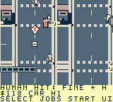
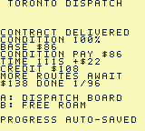

# ModRetro Games

Original open-source homebrew games for ModRetro Chromatic / Game Boy Color. Each game keeps its editable project, artwork, design and verification record in `games/<game-slug>/`.

| Game | Features | Current status |
| --- | --- | --- |
| [Toronto Dispatch](games/toronto-dispatch/) | North-up courier sandbox, six Toronto districts, 96 contracts, walking/driving and scheduled transit | Native prototype; current UI replay completes one delivery. The retained e797 campaign reaches 22 unique completions. Full campaign, two enjoyable human hours and hardware remain pending. |

Toronto Dispatch contains 241 buildings, 595 pedestrian routes, 59 service points, seven parking anchors and four player vehicles. Explore compressed mainland neighbourhoods, Port Lands industry/bridges and public walking Islands. Momentum/braking, pedestrians and police consequences, scheduled train/bus/Queen/ferry travel, a scrollable atlas, original audio and save v9 progression are implemented.

 

Unmodified Core emulator frames from retained `e797…`; [provenance](games/toronto-dispatch/docs/screenshots/courier-clearance-provenance.json) records their exact frames and hashes.

## Play or load

Read the [controls and features](games/toronto-dispatch/README.md) and [Chromatic loading guide](games/toronto-dispatch/docs/LOADING.md). Selected local ROM is `toronto-dispatch-ui-polish-direct.gbc`, 524,288 bytes, SHA-256 `03e09fa85351c91f56d7370a3f0e0f856cd147a3c8d5ebfd328a2786a38f25d6`. The new active-job board shows the current stop and resumes with A; completed car entry immediately refreshes the driving HUD. Select on the board jumps to the next eight-job chapter. RESULT B closes the receipt without reversing while held; release and press B again to brake/reverse normally.

Official build/resource and full source checks pass. A fresh [scoped native replay](games/toronto-dispatch/docs/NATIVE_UI_POLISH_SAMPLES.json) verifies active-job previews/resume, entry/pause/map controls, one full-condition delivery and in-worker saved-progress reset. Independent compiled/native reviews pass 597 / 5,253 checks; published evidence passes 481 checks. Packaging is verified separately. The earlier [22-completion campaign](games/toronto-dispatch/docs/NATIVE_CAMPAIGN_TWENTY_TWO_SAMPLES.json) and `825…` [performance comparisons](games/toronto-dispatch/docs/NATIVE_TERRAIN_CACHE_COMPARISON.json) retain their own ROM identities; their progress or measured gains are not attributed to this build.

Full Old Toronto, all 96 played contracts, two measured enjoyable human hours, wider pacing/balance, browser recovery and physical stream/flash/cold-boot/save persistence remain unverified. [TESTING.md](games/toronto-dispatch/TESTING.md) retains detailed evidence and failures. No hardware installation is claimed; [published Prototype 6](https://github.com/trancethehuman/modretro-games/releases/tag/v0.2.0-prototype.6) is a separate older release.

## Develop

Install the ModRetro Chromatic plugin, read [AGENTS.md](AGENTS.md) and the game's design/decisions/roadmap, then select `games/toronto-dispatch/project/project.gbsproj`. Follow [native build instructions](games/toronto-dispatch/docs/BUILD.md). Shared workflows live in [skills/](skills/), also exposed at `.agents/skills`.

```sh
python3 -m pip install --requirement requirements-dev.txt
make check
```

Repository checks validate sources and host engine behavior; native builds, emulator play and physical cartridge checks are separate evidence. Add new games under `games/<game-slug>/`; see [CONTRIBUTING.md](CONTRIBUTING.md).

Original code/art are [MIT licensed](LICENSE); [third-party notices](THIRD_PARTY_NOTICES.md) preserve upstream terms. This independent project is unaffiliated with ModRetro, Nintendo, Uber, the City or TTC.
