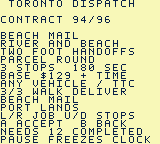
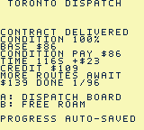

# Toronto Dispatch

A north-up, top-down pixel-art courier game for ModRetro Chromatic / Game Boy Color. Drive, brake into corners, park, walk and take timed transit through six compressed Toronto areas, including public walking Islands.

**Status: corrected six-scene ROM passes scoped native Islands exploration, ferry, map and reset checks; full campaign/hardware remain pending.** Source contains 241 buildings, 96 contracts, 59 service points, seven parking anchors, four player vehicle choices, paid scheduled subway/bus/ferry/Queen travel, a city atlas, original audio and SRAM progression. Roads have 48 pixels of asphalt plus sidewalks. Distinct civilians, six road vehicle kinds, impact consequences, escalating police pursuits and cosmetic water boats have scoped native evidence on the retained 88-contract `a243…` ROM. Its Port Lands record crosses all six bridges by car, walks Commissioners/Beach and verifies same-district reset/re-entry; truck/motorcycle/scooter and wider cases remain open. Historical Prototype 4's nine jobs retain their own ROM identity. Published Prototype 6 is separate; two hours, full Old Toronto/fuller Islands, human feedback, browser recovery and hardware remain unverified.

The sixth source scene connects the three public landings through Lakeshore/Cibola, Manitou, Algonquin/Snake bridge spurs and the southern boardwalk, with water, airport and restricted/private ground blocked. It has nine buildings and 37 authored pedestrian routes; road traffic is disabled. The existing 96 contracts and 59 identities remain, with only stops 20/21/22/24/25/26 relocated. Seven parking anchors and all rewards/deadlines/completion bits are preserved. Version-9 host migration, independent source-prefix tests and the corrected official build pass. The current local [loading candidate](docs/LOADING.md) is `project/build/toronto-dispatch-islands-safe.gbc`, SHA-256 **`7b2af59c27179bd3445c5c074b85fb4a029b50144ef27ed3095f9a3ce83f7d5a`**. Full checks pass with 787,948 engine and 25,107,699 UI cases. Its [closed ordinary-input replay](docs/NATIVE_ISLAND_DISTRICT_SAMPLES.json) explores all three docks/clients/bridges and inland/coastal choices, blocks shore/private yards/airport-water shortcuts, samples canopy occlusion and freezes all 58 game bytes while map focus/panning work. All three scheduled ferry roundtrips, seven $4 fares (cash 30→2), zero-fare return assistance with cancellation/reset and v9/paid/free resets pass. The original Core car is recovered; Market Start then delivers at condition 100 with credit 109/cash 111/done 1 and survives reset. This is free roaming plus one Core job; all nine Island jobs/deadlines, native old-v8 imports, crowded pacing, human and hardware acceptance remain pending.

The earlier six-scene `8a96…` recording failed after the pause AUDIO formatter overflowed its 40-byte UI buffer and corrupted cached map focus. Bounded label assembly fixes that defect; all three audio labels leave the cache unchanged on `7b2…`. Retained `4343…` evidence and the failed replay keep their separate scopes.

Unmodified Prototype5 native emulator frame; [provenance](docs/screenshots/provenance.json).

## Play

Select `project/project.gbsproj` with the ModRetro Chromatic plugin and build the current source. Run the exact inspected output file returned by the plugin in its native emulator or official browser preview. Generated ROMs are intentionally excluded from Git. See [build instructions](docs/BUILD.md) for tested build identities.

Prototype5 adds a [city atlas](docs/CITY_MAP.md) with job, parked-car and booked-transit-stop focus. Its exact ROM repeats the held-turn regression and verifies map pause/resume and paid-ride reset; see [test evidence](TESTING.md). Ready-made prototype bundles are on the [GitHub releases page](https://github.com/trancethehuman/modretro-games/releases). Follow the [loading instructions](docs/LOADING.md) for the supported development cartridge.

Published [Prototype 6](https://github.com/trancethehuman/modretro-games/releases/tag/v0.2.0-prototype.6) adds eight original curb signs and a scheduled [501 Queen game service](docs/STREETCAR.md) through west, core and east. It has 51 service points while preserving every existing client and all 88 contracts. Its sampled native scenarios cover paid cross-district travel, pause/map/reset, car recovery and legacy train/bus/ferry alighting.

Newer source adds an original moving Queen streetcar with door poses and scene-following paid rides, plus occasional [planes and helicopters](docs/AIRCRAFT.md) above the city. Flybys vary in direction and path, helicopters animate their rotors, and both cast separated shadows. These cosmetic flights pause with menus and maps. Current source writes version 9 at the same 58-byte size, reads valid supported older checkpoints and migrates legitimate old Island positions before current-terrain validation. Pre-v8 imports clear obsolete cursor words; v8 attention remains preserved. Older ROMs cannot read rewritten v9 records. Source also corrects overlapping traffic recovery, booked tram occupancy and unsafe alighting; the earlier exact `14005662…` replay retains its own evidence.

Retained fused output `project/build/toronto-streetlife-fused.gbc`, SHA-256 **`a243834899097d9660190022f03ce31d322d2584d0d7cfe1fdf8adb84a8902ea`**, passes its official build/resource/1,098-byte reserve guards and full `make check`. Ordinary-control recordings sample H1 impact/stumble, map/attention reset, road police capture, park/exit/walking/blocked Core shore/a visible boat, and a separate condition-100 first delivery at cash 139/done one. Correct paired pacing measures 108 updates/360 VBlanks, below the retained 132 baseline. A separate [9,988-frame Port driving record](docs/NATIVE_PORT_DRIVING_SAMPLE.json) crosses Lake Shore, Cherry North, Commissioners, Cherry South, Ship Channel and Unwin decks by car, walks Commissioners with the car parked, resets/restores that Port checkpoint, parks/walks Beach to actual water at `(423.625,935.625)`, re-enters and drives back to East. H2/H3 escalation with cash zero does not prove higher fine amounts. Earlier `a212dd9e…`, `bd09f1c3…` and `555f3d31…` keep their own scopes.

Retained `project/build/toronto-port-campaign-clock.gbc`, SHA-256 **`c625e6dce80a56a787c940885da5abd332fce47335e52f57698c3395a14ba364`**, compiles **96 contracts/59 stops** with seven parking anchors, preserving all earlier native records/briefs. Its full checks, compiled/header gates and 1,098 static bytes pass. Port work includes truck equipment, fragile glass, express files, park handoffs and a closed return kit. Deadlines remain provisional, only Leslie connects Port, and no 114 service is added. Old88-job ROMs reject saved new jobs/completion bits despite the same 58-byte v8 state/16 completion bytes.

The [closed exact-ROM replay](docs/NATIVE_PORT_CAMPAIGN_SAMPLES.json) completes three original jobs and FIRE HALL BOOKS (contract 90/index 89): Riverside pickup, Leslie trip, parking, walking around the blocked Fire Hall footprint, delivery with condition 36 / cash 71 / done 4, genuine reset/restored completion and Port car re-entry. This verifies one of eight new jobs, not the full campaign or balance. Higher attention/capture occurs without isolating sufficient-cash higher fines. Stationary 110/360 versus older 108 is a tiny scoped timing difference; wider pacing, other seven jobs, all 96 progression, two hours, browser and physical play remain pending. These changes are absent from downloadable Prototype 6; [TESTING.md](TESTING.md) scopes exact records.

Retained five-scene candidate `project/build/toronto-dispatch-route-feedback.gbc`, SHA-256 **`4343f2b858e62f9e8daa2a3576a1d06bb7ee7208d2cd4a55434c36e168fb3100`**, adds the full ordered itinerary before accepting a quest and an exact completion payout breakdown. Browse each place, district, return and walking requirement. Results show condition, base, condition-adjusted pay, time bonus and actual credit, including the balance cap. Native route/lock/first-payment/timeout/reset and a separate paid train/map/reset sample pass; every authored page and cap arithmetic have independent host checks. ROM-table tram interpolation preserves geometry/timing without persistent RAM; a scoped stationary sample improves from 348 to 381 updates over 1,080 VBlanks. The new one-byte itinerary cursor leaves 1,097 static bytes. [Portable evidence](docs/NATIVE_DISPATCH_UI_SAMPLES.json) retains this build's scope; full campaign, human readability and physical play remain pending.

Unmodified native frames from this candidate; [provenance](docs/screenshots/provenance.json).

| Action | Controls |
| --- | --- |
| Accelerate / coast | Hold A / release A |
| Steer the vehicle | Left / right; brake for tighter corners |
| Brake / reverse | B; keep holding near rest to reverse |
| Accept or deliver a package | Select opens dispatch, then A accepts; Select at a beacon while stopped collects/delivers |
| Plan a quest | Dispatch: left/right selects contracts, up/down browses ordered stops; A accepts, B returns |
| Pause menu | Start; up/down and A choose |
| Park and exit | Stop, then pause → Park / recover car |
| Walk | D-pad; A near the parked car animates entry |
| Transit | On foot, B at a station/terminal/platform; left/right chooses destination, A waits/boards |
| Change service | Up/down at Wellesley switches Line 1 / 94 bus |
| Scrollable city map | Pause → map; D-pad pans, A centres job / booked transit stop / depot; Select changes focus, B returns |
| Change vehicle / save | Pause menu; change vehicle while stopped without an active job |
| Sound | Pause → Audio; cycle full music/effects, effects only, or silent |

First job: accept contract 1 at the Union depot, press Select to collect, drive east along Front Street to St. Lawrence Market, brake and press Select to deliver. The marker and HUD identify the next waypoint. Pickup is the first of the displayed stops. Source has 72 original contracts plus eight western, eight eastern and eight Port Lands jobs, with distinct routes/titles and brief instructions. The nine original chapters and supplemental regional jobs unlock through unique completions; dispatch selects the next eligible unfinished compatible contract. Replays pay but do not increment unique completion twice. Port Lands deadlines start at 170/175/205/185/150/180/120/200 seconds and require played tuning; menus do not create gameplay duration.

Transit runs on a repeating **fictional game clock**, even without the player. Fares are 3 for subway, 2 for bus and 4 for ferry; Queen also costs 3. These are game credits, not real TTC prices. At a Queen sign, choose a destination; the menu shows eastbound/westbound, departure countdown and trip cost/time. Each direction repeats every 64 seconds with a two-second boarding window, and a ride takes four seconds per selected stop interval. Choosing the current stop cannot board. Waiting/riding uses mission time; menus and the map pause it. Heavy freight and passenger jobs require their road vehicle. Parking leaves that vehicle behind for recovery. Ferry routes connect through the mainland; public footpaths also connect the Island landings. Ordinary cars cannot reach the Islands. An idle courier with less than four credits can take the scheduled assisted return from an Island dock to the mainland without a fare.

Driving retains momentum through steering and glancing curb contact. A bounded sideways adjustment helps clear narrow tile corners while accelerating; broad walls still stop the vehicle. Fragile crates take greater crash damage. Fast passenger turns reduce comfort, and base rewards scale with condition. Two alternating CRC-checked save records retain a previous checkpoint if a write is interrupted. Paid rides resume from their latest second after a reset. Physical power-off persistence still needs a cartridge test.

Pedestrians follow 595 fixed routes with six nearby original civilians. Road slots show car, truck, police, fire, ambulance and bus, obeying fictional 12-second lights and junction clearance; the visible bus remains separate from paid boarding. Ordinary motion advances every sixteen active VBlanks, pursuit every four; courier/safety checks and guarded overlap escape retain their active-update cadence. Eight-pixel sweep caps can discard delayed elapsed time, so nominal 30-pixel/second traffic is not guaranteed. Exact terrain tests cover the full swept body. The transient 87-byte snapshot validates all bodies once, excludes only safely distant centre buckets and commits accepted endpoints sequentially after full terrain/tram clearance, adding no persistent RAM. Cosmetic boats remain on authored Core/Port water and clip beneath existing decks; they cannot be driven or boarded. Island road fleets, collision occupancy, lights and pursuit are disabled; public pedestrians remain active.

Human impacts cause a non-graphic six-second stumble, ten carried-condition damage per person and a fine of $20 × hits × resulting attention `H` (maximum three). Police follow connected local roads and capture within 32 pixels on both axes for $25 × H², clearing attention. Thirty active seconds away from the police's 96-pixel range cool one level. Menus freeze time; all paid rides suppress pursuit. These rules implement the selected chaotic sandbox direction; scoped H1 capture passes, while higher heat, escape, balance and broad pacing remain pending. Combat, lethal rules and stealing NPC vehicles are not adopted.

Original city music, engine, braking and event effects have historical emulator PCM evidence; physical speaker/headphone testing remains open. See [audio design and reproduction](docs/AUDIO.md).

For installation, use the [loading instructions](docs/LOADING.md). ROM bundles require the [distribution notices](docs/DISTRIBUTION.md). This prototype has not been verified for two hours of gameplay.

## Source and scope

- [City map controls and implementation](docs/CITY_MAP.md).
- [Port Lands original layout, bridges, industry and source jobs](docs/PORT_LANDS_PLAN.md).
- [Fuller Islands research and source-art plan](docs/ISLAND_DISTRICT_PLAN.md) and [versioned integration plan](docs/ISLAND_RUNTIME_PLAN.md). The sixth native scene is registered in source; six stable endpoints and version-9 migration are integrated. Corrected `7b2…` passes scoped exploration/ferry/map/v9-reset checks; native old-v8 migration and the nine jobs remain pending.
- [Islands preparation evidence](docs/NATIVE_ISLAND_PREPARATION_SAMPLES.json): five-scene `ff5d…` regression, separate from the later registered sixth scene and the retained `4343…` five-scene bundle.
- [Queen platforms, fictional timetable and transit research](docs/STREETCAR.md).
- [Design](DESIGN.md), [decisions](DECISIONS.md), [roadmap](ROADMAP.md) and [test evidence](TESTING.md).
- [Old Toronto research](docs/TORONTO_RESEARCH.md) and [geography boundaries](docs/GEOGRAPHY.md).
- [Proposed district expansion](docs/OLD_TORONTO_EXPANSION.md) and [runtime audit](docs/WORLD_RUNTIME_AUDIT.md).
- [Editable GB Studio project](project/project.gbsproj) and [native scene engine](project/plugins/toronto-driving/engine/).
- [Compiled campaign specification](content/campaign.json) and [original world/art specification](content/city_art.json).
- [Asset generators and collision/connectivity validator](scripts/).

The present source compresses central Toronto, Parkdale/Roncesvalles, High Park/Swansea/Junction, Riverside/Riverdale/Leslieville/western Danforth, Port Lands/Donmouth and Toronto Islands. Six 1,024 × 976 scenes occupy a logical 4,096 × 1,952 atlas; the browsable 512 × 244 schematic leaves unregistered lower cells solid and unnamed. Queen service uses eight shared directional platform pairs on the normal corridor with fictional operation; current construction detours are omitted and the map era remains unadopted. The wider historical municipality, neighbourhood detail, broader Island/native acceptance, full 501, King 504 and full TTC network remain unfinished. Landmark art is an original interpretation. The original three mission design samples remain in `content/missions.json`; runtime contracts are in `campaign.json`.

Original code and artwork use the root MIT licence. Starter font/metadata retain their upstream notices. No commercial courier branding, map imagery or TTC logo is included.
