# Toronto Dispatch

A north-up, top-down pixel-art courier game for ModRetro Chromatic / Game Boy Color. Drive, brake into corners, park, walk and take timed transit through four compressed Toronto areas and selected Island routes.

**Status: Prototype 6 milestone.** The native game contains four linked scenes, four vehicles, 88 authored contracts, the downtown street plan from the City of Toronto Centreline, moving pedestrians and traffic, paid scheduled subway/bus/ferry travel, a scrollable city atlas, original music/effects, and SRAM progression. Roads have 48 pixels of asphalt plus sidewalks. Prototype 4's native tests completed nine distinct jobs and kept the car moving through the previously stopping turn while acceleration stayed held. Build-specific checks also cover walking/car entry, collision and roof occlusion, transit, timeout/retry, pause and reset recovery. The two-hour release target, full Old Toronto coverage, physical cartridge testing and further handling polish remain open.

 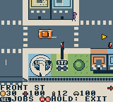 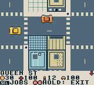 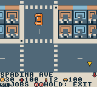

 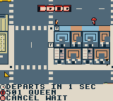 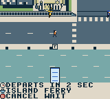 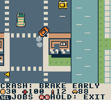

Development build, 2026-10-07: the downtown street plan from the City of Toronto Centreline with neighbourhood blocks and landmarks in place, the station prompt, the 501 pulling in, the ferry coming in over the harbour and the larger cars. Unmodified PyBoy frames (some staged by writing the courier's position in emulator memory); [provenance](docs/screenshots/provenance.json).

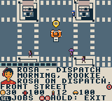   

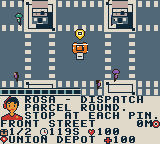 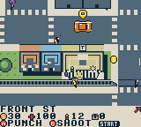 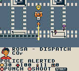  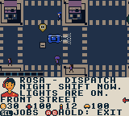

Development build: Rosa's radio calls, the pause menu and dispatch board as bottom sheets, a contract briefing with the distance readout, pistol lock-on and a long tracer round, a damaged car smoking and a stolen blue car with its own headlamp beam at night. Some frames are staged by writing car damage, paint or the play clock in emulator memory, as listed in the [provenance](docs/screenshots/provenance.json).

 

 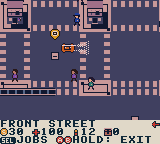  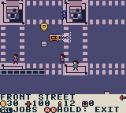

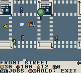 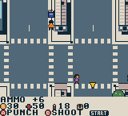 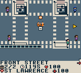 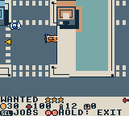

Development build: title, driving camera and the pause clock; the day/night cycle (golden hour, dusk, night, dawn); tyre smoke, a pickup and a parcel popping up and the patrol car's light bar. PyBoy frames, unmodified; some are staged by writing the play clock or position in emulator memory, as listed in the [provenance](docs/screenshots/provenance.json).

Unmodified Prototype5 native emulator frame; [provenance](docs/screenshots/provenance.json).

## Play

Select `project/project.gbsproj` with the ModRetro Chromatic plugin and build the current source. Run the exact inspected output file returned by the plugin in its native emulator or official browser preview. Generated ROMs are intentionally excluded from Git. See [build instructions](docs/BUILD.md) for tested build identities.

Prototype5 adds a [city atlas](docs/CITY_MAP.md) with job, parked-car and booked-transit-stop focus. Its exact ROM repeats the held-turn regression and verifies map pause/resume and paid-ride reset; see [test evidence](TESTING.md). Ready-made prototype bundles are on the [GitHub releases page](https://github.com/trancethehuman/modretro-games/releases). Follow the [loading instructions](docs/LOADING.md) for the supported development cartridge.

Current source adds eight original curb signs and a scheduled [501 Queen game service](docs/STREETCAR.md) through west, core and east. The source has 51 service points while preserving every existing client and all 88 contracts. The final native Queen candidate completed three paid cross-district rides, paused/mapped a paid trip, reset and recovered the car. Its separate legacy train/bus/ferry sample verifies that the courier arrives beside the parked car at Union and can walk away and re-enter it. The earlier blocked-arrival failure remains documented. These are sampled scenarios; see the [Prototype 6 milestone](https://github.com/trancethehuman/modretro-games/releases/tag/v0.2.0-prototype.6) and [exact test record](TESTING.md).

| Action | Controls |
| --- | --- |
| Accelerate / coast | Hold A / release A |
| Steer the vehicle | Left / right; brake for tighter corners |
| Brake / reverse | B; keep holding near rest to reverse |
| Accept or deliver a package | Select opens dispatch, then A accepts; Select at a beacon while stopped collects/delivers |
| Pause menu | Start; up/down scroll four actions at a time, A chooses |
| Park and exit | Stop, then hold A+B, or pause → Park / recover car |
| Walk | D-pad; A near the parked car animates entry |
| On foot | D-pad walks and aims; A beside a road vehicle takes it, otherwise punches; B away from a stop fires at the locked-on target (red brackets), hold B to keep firing |
| Pickups | Walk or drive over cash, first aid or ammunition on the pavement |
| Transit | On foot, B at a station/terminal/platform; left/right chooses destination, A waits/boards |
| Change service | Up/down at Wellesley switches Line 1 / 94 bus |
| Scrollable city map | Pause → map; D-pad pans, A centres job / booked transit stop / depot; Select changes focus, B returns |
| Change vehicle / save | Pause menu; change vehicle while stopped without an active job |
| Repair | Pause → Supplies ($20) heals, adds ammunition and repairs the car |
| Sound | Pause → Audio; cycle full music/effects, effects only, or silent |

First job: accept contract 1 at the Union depot, press Select to collect, drive east along Front Street to St. Lawrence Market, brake and press Select to deliver. The marker and HUD identify the next waypoint. Pickup is the first of the displayed stops. The 72 original contracts, plus eight western and eight eastern jobs, have distinct routes/titles, brief instructions and nine progression chapters. Completion unlocks truck/transit jobs, passenger work and Island walking rounds. Dispatch selects the next eligible unfinished contract. Replays pay but do not increment unique completion twice.

Transit runs on a repeating **fictional game clock**, even without the player. Fares are 3 for subway, 2 for bus and 4 for ferry; Queen also costs 3. These are game credits, not real TTC prices. At a Queen sign, choose a destination; the menu shows eastbound/westbound, departure countdown and trip cost/time. Each direction repeats every 64 seconds with a two-second boarding window, and a ride takes four seconds per selected stop interval. Choosing the current stop cannot board. Waiting/riding uses mission time; menus and the map pause it. Heavy freight and passenger jobs require their road vehicle. Parking leaves that vehicle behind for recovery. Island ferries connect through the mainland, and ordinary cars cannot reach the Islands.

Driving retains momentum through steering and glancing curb contact. A bounded sideways adjustment helps clear narrow tile corners while accelerating; broad walls still stop the vehicle. Fragile crates take greater crash damage. Fast passenger turns reduce comfort, and base rewards scale with condition. Two alternating CRC-checked save records retain a previous checkpoint if a write is interrupted. Paid rides resume from their latest second after a reset. Physical power-off persistence still needs a cartridge test.

Rosa, the depot dispatcher, calls in on the radio with briefings, chapter news, police warnings and city chatter while play continues; the HUD shows the distance to the objective. The car wears from crashes, smokes and loses power until repaired. Pedestrians follow 620 fixed sidewalk routes across the four areas with eight nearby people rendered at a time, in six designs and four colours; road vehicles come in eight designs and seven paints. Traffic follows continuous loops, yields to the courier crossing on foot and keeps returning just beyond the screen edge so nearby streets stay busy. Crimes draw police attention in stars; the police chase without overwhelming speed, arrests need a firm hold and officers only shoot from four stars. Sidewalk pickups give cash, first aid or ammunition. The visible bus currently uses a truck-shaped placeholder and has a separate animation path from the boarding timetable. Dedicated TTC vehicle art and matching visible service schedules remain planned. Original city music, engine, braking and event effects have been verified through emulator PCM capture; physical speaker/headphone testing remains open. See [audio design and reproduction](docs/AUDIO.md).

For installation, use the [loading instructions](docs/LOADING.md). ROM bundles require the [distribution notices](docs/DISTRIBUTION.md). This prototype has not been verified for two hours of gameplay.

## Source and scope

- [City map controls and implementation](docs/CITY_MAP.md).
- [Queen platforms, fictional timetable and transit research](docs/STREETCAR.md).
- [Design](DESIGN.md), [decisions](DECISIONS.md), [roadmap](ROADMAP.md) and [test evidence](TESTING.md).
- [Old Toronto research](docs/TORONTO_RESEARCH.md) and [geography boundaries](docs/GEOGRAPHY.md).
- [Proposed district expansion](docs/OLD_TORONTO_EXPANSION.md) and [runtime audit](docs/WORLD_RUNTIME_AUDIT.md).
- [Editable GB Studio project](project/project.gbsproj) and [native scene engine](project/plugins/toronto-driving/engine/).
- [Compiled campaign specification](content/campaign.json) and [original world/art specification](content/city_art.json).
- [Asset generators and collision/connectivity validator](scripts/).

The present city compresses central Toronto, Parkdale/Roncesvalles, High Park/Swansea/Junction and Riverside/Riverdale/Leslieville/western Danforth. Queen service uses eight shared directional platform pairs on the normal corridor with fictional operation; current construction detours are omitted and the map era remains unadopted. The wider historical municipality, neighbourhood detail, full 501, King 504 and full TTC network are future work. Landmark art is an original interpretation. The original three mission design samples remain in `content/missions.json`; runtime contracts are in `campaign.json`.

Original code and artwork use the root MIT licence. Starter font/metadata retain their upstream notices. No commercial courier branding, map imagery or TTC logo is included.
