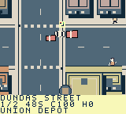
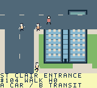

# Toronto Dispatch

A north-up, top-down pixel-art courier sandbox for ModRetro Chromatic / Game Boy Color. Drive with momentum and braking, park and walk, or pay for scheduled transit while delivering timed jobs through seven compressed Toronto districts. The latest candidate adds clear ferry planning and recovery guidance; older campaign records retain their original ROMs.

## Play and install

Latest local playtest candidate is `project/build/toronto-dispatch-ferry-clarity.gbc`, **1,048,576 bytes**, SHA-256 **`a9353a76c1e792ee09f9bbd35efe9d8957b54edfbcf7658fa76bd93240ae803b`**. Official build, full source checks and focused compiled review pass. Follow the [Chromatic loading guide](docs/LOADING.md), [build record](docs/BUILD.md) and [fresh native record](docs/NATIVE_FERRY_CLARITY.json). This exact ROM verifies ferry hints, paid travel, low-cash cancellation/free return, original-car walking/entry, one fresh delivery and in-worker reset. Its predecessor's police/three-job outcomes stay separate. Generated ROMs stay out of Git. Published [Prototype 6](https://github.com/trancethehuman/modretro-games/releases/tag/v0.2.0-prototype.6) and older local packages retain their own identities.

Prepared local `project/build/toronto-dispatch-ferry-clarity.zip` contains the tested ROM, checksums and loading instructions: **146,589 bytes**, SHA-256 `5d2b70221cd411902ad250ec34d35854a93f7a6a4010097c2712b9a050c4735d`, pinned to source `f71d07e39d4f5d61ae06b06468a094d628e8164e`. [BUILD.md](docs/BUILD.md) records its verification scope; the bundle remains local. The retained traffic ZIP still contains e4a9 and keeps its own [package audit](docs/RIGHT_HAND_TRAFFIC_PACKAGE_AUDIT.json).

| Action | Controls |
| --- | --- |
| Drive | A accelerates; left/right steer; B brakes and then reverses near rest |
| Leave menus / delivery result | Menu-used A/B stay consumed until released. Release and press again to accelerate or brake/reverse; steering and walking work normally. RESULT A opens dispatch |
| Plan a quest | Without active work, Select opens dispatch; during work use Pause → Dispatch jobs. Select jumps chapters, left/right selects offers, up/down browses stops; A accepts a new job or resumes active work, B returns |
| Collect / hand off | Select at each ordered marker; finish returning jobs at their final stop |
| Walk / enter car | Pause → Park / recover car; D-pad walks, A enters near the parked car |
| Vehicle | Pause → Change vehicle, while stopped and permitted by the job |
| Transit | On foot, B at a station/terminal/platform; left/right selects, A waits/boards. At Wellesley, up switches train/bus |
| City map | Pause → Scroll City Map; D-pad pans, A centres job/booked stop/depot, Select changes focus, B returns |
| Save / audio | Pause menu; Audio cycles music + effects, effects only and silent |

When accepting a quest, review every stop and walking/return cue. An active preview shows CURRENT STOP separately from its browsed itinerary; A resumes the carried job without replacing it. Arrival alone does not advance a handoff: use Select. Mainland cars stay parked during transit and Island walking. Island offers show $8/$16/$24 ferry budgets; optional trips and fines need extra cash. If an active job cannot fund the return, follow Start → Cancel Active Job, then B at the dock for scheduled $0 assistance. Cancellation pays nothing and earns no completion; cancelling WAIT alone keeps the job active.

## City and jobs

Current source contains **344 buildings, 657 fixed pedestrian routes, 104 contracts, 64 service points and nine mainland parking anchors**. Four player vehicles, wide roads, varied original buildings, walking/car entry, roof/canopy occlusion, a scrollable atlas, original audio and save v10 / 58-byte progression are implemented in current source. The seven areas cover compressed Core, western neighbourhoods, High Park/Junction, eastern neighbourhoods, Port Lands, public Islands and Uptown Hills. North adds researched railway underpasses, foot-only Baldwin Steps, public Casa Loma/Rosehill handoffs and two fictional Line1 landings; it preserves the previous 96 contracts and 59 stops.

Jobs include packages, fragile art, freight, signatures/returns and transit relays. Port Lands uses legal Leslie access and authored collision-backed bridges; Islands use ferry/public walking paths. Civilian impacts cause non-graphic recovery, condition loss on carried jobs, escalating fines and local police pursuit. Six road vehicle kinds obey fictional signals; planes/helicopters and under-deck boats are cosmetic. Visible road traffic and paid transit schedules are separate game abstractions.

 

Original 160 × 144 emulator frames from retained `e4a9…`: Core at frame 7,322 and St Clair at 13,648. Its [native record](docs/NATIVE_RIGHT_HAND_TRAFFIC.json) retains exact provenance. Current a935 frames and the low-cash return are in the separate [ferry recovery record](docs/NATIVE_FERRY_CLARITY.json).

## Verified scope

Current `a935…` passes the official build, full `make check` and [focused compiled review](docs/FERRY_CLARITY_BUILD_AUDIT.json). Only UI changes among 206 native inputs; jobs, collision/art, fares, schedules, main/police/save bank bytes and save v10 / 58 are preserved. UI/gameplay/helper banks leave 122/10/1 bytes, with 1,096 static reserve and no peak-stack guarantee.

Its [fresh closed replay](docs/NATIVE_FERRY_CLARITY.json) samples all nine planning budgets, eight paid trains and one paid ferry, then actively rejects a return at $2 with 96 seconds left. Explicit cancellation keeps cash and zero completions; scheduled free assistance returns to the mainland, followed by walking/entry into the original car. A newly accepted Market job credits 108 at full condition, ends $110 / done 1 and survives a genuine in-worker button reset. A transient blank arrival image settles after a later neutral interval. Mistaken controller deadline, marker and mode expectations remain disclosed.

The retained e4a9 [replay](docs/NATIVE_RIGHT_HAND_TRAFFIC.json) delivers jobs 0/1/2, shows $20/$40/$60 human-impact fines and a carried H3 delivery, then underfunded H3 capture takes $95 to zero while preserving accepted work. A recovery delivery and two $3 Union–St Clair trips end $101; the parked obstruction clears and police rejoins its circuit. Those police/North/three-job observations belong to that older ROM.

An initial `fc2ef…` traffic run remains [needs-review](docs/NATIVE_TRAFFIC_INITIAL_REVIEW.json). The coordinate filter preserves 3,306,549 actual-C query results and reduces membership-exit work 94.8% in that synthetic workload. No matched native speedup, whole-city frame rate, hardware or human-duration claim is inferred.

The [older North records](docs/NORTH_DISTRICT.md) belong to unchanged `22157…`: three records reach six growing completions; a fourth reaches eight but remains needs-review after its Pause-close reverse leak. Old underpass/campaign results are not inherited. Earlier `03e09…` two-job and `e797…` 22-job campaign records remain in [TESTING.md](TESTING.md); their exact ROM/source/package pins remain in [BUILD.md](docs/BUILD.md).

All 104 contracts, remaining region/Island routes, full Old Toronto, two measured enjoyable human hours, wider handling/balance/pacing/stack, native older-save imports, browser recovery, human handling/audio and physical cartridge execution remain pending.

## Develop

Select `project/project.gbsproj` with the ModRetro Chromatic plugin. Read [DESIGN.md](DESIGN.md), [DECISIONS.md](DECISIONS.md) and [ROADMAP.md](ROADMAP.md) before changing gameplay; follow [BUILD.md](docs/BUILD.md) and run `make check` from the repository root. Original code/art are MIT licensed; [distribution notices](docs/DISTRIBUTION.md) retain upstream terms.
