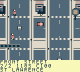

# Toronto Dispatch

A north-up, top-down pixel-art courier game for ModRetro Chromatic / Game Boy Color. Drive, brake into corners, park, walk and take timed transit through a compressed central Toronto and its Islands.

**Status: playable native prototype.** The ROM builds and boots with four vehicles, 72 engine-integrated contracts, 80 buildings, moving pedestrians and traffic, paid scheduled subway/bus/ferry travel, a scrollable map, and SRAM progression. Native tests cover delivery rewards, walking/car entry, building collision and roof occlusion, transit, timeout/retry, pause and reset recovery. The two-hour release target, full Old Toronto coverage, audio, physical cartridge testing and further handling polish remain open.

## Play

Select `project/project.gbsproj` with the ModRetro Chromatic plugin, then build `build/toronto-dispatch.gbc`. Run that exact file in the plugin's native emulator or the official browser preview. Generated ROMs are intentionally excluded from Git. See [build instructions](docs/BUILD.md).

| Action | Controls |
| --- | --- |
| Accelerate / coast | Hold A / release A |
| Steer the vehicle | Left / right; brake for tighter corners |
| Brake / reverse | B; keep holding near rest to reverse |
| Accept or deliver a package | Select opens dispatch, then A accepts; Select at a beacon while stopped collects/delivers |
| Pause menu | Start; up/down and A choose |
| Park and exit | Stop, then pause → Park / recover car |
| Walk | D-pad; A near the parked car animates entry |
| Transit | On foot, B at a station/terminal; left/right chooses destination, A waits/boards |
| Change service | Up/down at Wellesley switches Line 1 / 94 bus |
| Scrollable map | Pause → map; D-pad pans, A centres objective, B returns |
| Change vehicle / save | Pause menu; change vehicle while stopped without an active job |

First job: accept contract 1 at the Union depot, press Select to collect, drive east along Front Street to St. Lawrence Market, brake and press Select to deliver. The marker and HUD identify the next waypoint. Pickup is the first of the displayed stops. Contracts include fragile art, express files, truck freight, transit relays, passenger runs, return papers and Island post. Completion unlocks truck/transit jobs, passenger work and Island rounds. Replays pay but do not increment unique completion twice.

Transit runs on a repeating **fictional game clock**, even without the player. Fares are 3 for subway, 2 for bus and 4 for ferry; these are game credits, not real TTC prices. Waiting/riding uses mission time; menus and the map pause it. Heavy freight and passenger jobs require their road vehicle. Parking leaves that vehicle behind for recovery. Ordinary cars cannot reach the Islands.

## Source and scope

- [Design](DESIGN.md), [decisions](DECISIONS.md), [roadmap](ROADMAP.md) and [test evidence](TESTING.md).
- [Old Toronto research](docs/TORONTO_RESEARCH.md) and [geography boundaries](docs/GEOGRAPHY.md).
- [Editable GB Studio project](project/project.gbsproj) and [native scene engine](project/plugins/toronto-driving/engine/).
- [Compiled campaign specification](content/campaign.json) and [original world/art specification](content/city_art.json).
- [Asset generators and collision/connectivity validator](scripts/).

The present city compresses downtown streets and a few service areas. The wider historical municipality, neighbourhood detail and full TTC/streetcar network are future map work. Landmark art is an original interpretation. The original three mission design samples remain in `content/missions.json`; runtime contracts are in `campaign.json`.

Original code and artwork use the root MIT licence. Starter font/metadata retain their upstream notices. No commercial courier branding, map imagery or TTC logo is included.
