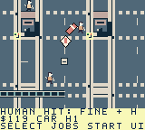

# Toronto Dispatch

A north-up, top-down pixel-art courier sandbox for ModRetro Chromatic / Game Boy Color. Drive with momentum and braking, park and walk, or pay for scheduled transit while delivering timed jobs through six compressed Toronto districts.

## Play and install

The current local candidate is `project/build/toronto-dispatch-pedestrian-admission.gbc`, **524,288 bytes**, SHA-256 **`964f4ad40275eb373c7a2e2cb500a0bdc84220fe0093f6333d317a25e89d409a`**. Follow the [Chromatic loading guide](docs/LOADING.md); generated ROMs stay out of Git. Use the ModRetro Chromatic plugin's native emulator or official preview to play the exact inspected build. Published [Prototype 6](https://github.com/trancethehuman/modretro-games/releases/tag/v0.2.0-prototype.6) remains an older separate release.

| Action | Controls |
| --- | --- |
| Drive | A accelerates; left/right steer; B brakes and then reverses near rest |
| Close delivery result | B returns to the city without reversing while held. Release B, then press it again for normal braking/reverse. A opens dispatch |
| Plan a quest | Select opens dispatch; left/right selects jobs, up/down browses ordered stops; A accepts, B returns |
| Collect / hand off | Select at each ordered marker; finish returning jobs at their final stop |
| Walk / enter car | Pause → Park / recover car; D-pad walks, A enters near the parked car |
| Vehicle | Pause → Change vehicle, while stopped and permitted by the job |
| Transit | On foot, B at a station/terminal/platform; left/right selects, A waits/boards. At Wellesley, up switches train/bus |
| City map | Pause → Scroll City Map; D-pad pans, A centres job/booked stop/depot, Select changes focus, B returns |
| Save / audio | Pause menu; Audio cycles music + effects, effects only and silent |

When accepting a quest, review every stop and walking/return cue. Arrival alone does not advance a handoff: use Select. Mainland cars stay parked during transit and Island walking; an idle Island courier with insufficient cash has scheduled $0 return assistance.

## City and jobs

Source contains **241 buildings, 595 fixed pedestrian routes, 96 contracts, 59 service points and seven mainland parking anchors**. Four player vehicles, wide roads, varied original buildings, walking/car entry, roof/canopy occlusion, a scrollable atlas, original audio and save v9 / 58-byte progression are implemented. The six areas cover compressed Core, western neighbourhoods, High Park/Junction, eastern neighbourhoods, Port Lands and public Islands.

Jobs include packages, fragile art, freight, signatures/returns and transit relays. Port Lands uses legal Leslie access and authored collision-backed bridges; Islands use ferry/public walking paths. Civilian impacts cause non-graphic recovery, condition loss on carried jobs, escalating fines and local police pursuit. Six road vehicle kinds obey fictional signals; planes/helicopters and under-deck boats are cosmetic. Visible road traffic and paid transit schedules are separate game abstractions.

 

Unmodified sampled Core frames 1,152 and 564 on current `964f…`; [provenance](docs/screenshots/pedestrian-admission-provenance.json).

## Verified scope

Current `964f…` passes official/header/compiled guards and full repository checks, with a 1,096-byte static reserve. Its [fresh native replay](docs/NATIVE_PEDESTRIAN_ADMISSION_SAMPLES.json) completes Market Start, keeps the car stopped during held RESULT B while the world runs, confirms a continuously visible pedestrian impact, freezes game/person/fleet state on the map and restores saved cash/progression/attention through a genuine game-button reset. The specific first-appearance correction has host/compiled evidence; the native impact is a different case. The final emulator checkpoint is saved only.

Earlier `a0bd…` matched transit/driving trials, four `d58…` bus/heat/patrol/campaign records and older Queen/13-job Island records retain their own hashes in [TESTING.md](TESTING.md) and [BUILD.md](docs/BUILD.md). Their wider acceptance is not inherited by this ROM.

All 96 played contracts/balance, eight remaining Island jobs, full Old Toronto, two measured enjoyable human hours, wider new-ROM transit/heat/district/pacing/stack, native older-save imports, browser recovery, human handling/audio and physical cartridge execution remain pending.

## Develop

Select `project/project.gbsproj` with the ModRetro Chromatic plugin. Read [DESIGN.md](DESIGN.md), [DECISIONS.md](DECISIONS.md) and [ROADMAP.md](ROADMAP.md) before changing gameplay; follow [BUILD.md](docs/BUILD.md) and run `make check` from the repository root. Original code/art are MIT licensed; [distribution notices](docs/DISTRIBUTION.md) retain upstream terms.
