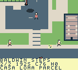
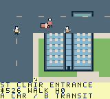

# Toronto Dispatch

A north-up, top-down pixel-art courier sandbox for ModRetro Chromatic / Game Boy Color. Drive with momentum and braking, park and walk, or pay for scheduled transit while delivering timed jobs through seven compressed Toronto districts. The latest northern playtest candidate has its own scoped checks; the prepared loading bundle remains separate below.

## Play and install

Latest local northern playtest candidate is `project/build/toronto-dispatch-north-initial.gbc`, **1,048,576 bytes**, SHA-256 **`22157d720c8746118da93bb7c3027ef24693a2e4697118e70e5a95fecddf0d95`**. Prepared local `toronto-dispatch-north-initial.zip` passes 1,235 independent package checks; its checksum and source pins are in [BUILD.md](docs/BUILD.md). The [Chromatic loading guide](docs/LOADING.md) selects this North ROM for local playtesting; generated ROMs stay out of Git. Use the ModRetro Chromatic plugin's native emulator to play the exact inspected build. Published [Prototype 6](https://github.com/trancethehuman/modretro-games/releases/tag/v0.2.0-prototype.6) remains an older separate release.

| Action | Controls |
| --- | --- |
| Drive | A accelerates; left/right steer; B brakes and then reverses near rest |
| Close delivery result | B returns to the city without reversing while held. Release B, then press it again for normal braking/reverse. A opens dispatch |
| Plan a quest | Without active work, Select opens dispatch; during work use Pause → Dispatch jobs. Select jumps chapters, left/right selects offers, up/down browses stops; A accepts a new job or resumes active work, B returns |
| Collect / hand off | Select at each ordered marker; finish returning jobs at their final stop |
| Walk / enter car | Pause → Park / recover car; D-pad walks, A enters near the parked car |
| Vehicle | Pause → Change vehicle, while stopped and permitted by the job |
| Transit | On foot, B at a station/terminal/platform; left/right selects, A waits/boards. At Wellesley, up switches train/bus |
| City map | Pause → Scroll City Map; D-pad pans, A centres job/booked stop/depot, Select changes focus, B returns |
| Save / audio | Pause menu; Audio cycles music + effects, effects only and silent |

When accepting a quest, review every stop and walking/return cue. An active preview shows CURRENT STOP separately from its browsed itinerary; A resumes the carried job without replacing it. Arrival alone does not advance a handoff: use Select. Mainland cars stay parked during transit and Island walking; an idle Island courier with insufficient cash has scheduled $0 return assistance.

## City and jobs

Current source contains **344 buildings, 657 fixed pedestrian routes, 104 contracts, 64 service points and nine mainland parking anchors**. Four player vehicles, wide roads, varied original buildings, walking/car entry, roof/canopy occlusion, a scrollable atlas, original audio and save v10 / 58-byte progression are implemented in current source. The seven areas cover compressed Core, western neighbourhoods, High Park/Junction, eastern neighbourhoods, Port Lands, public Islands and Uptown Hills. North adds researched railway underpasses, foot-only Baldwin Steps, public Casa Loma/Rosehill handoffs and two fictional Line1 landings; it preserves the previous 96 contracts and 59 stops.

Jobs include packages, fragile art, freight, signatures/returns and transit relays. Port Lands uses legal Leslie access and authored collision-backed bridges; Islands use ferry/public walking paths. Civilian impacts cause non-graphic recovery, condition loss on carried jobs, escalating fines and local police pursuit. Six road vehicle kinds obey fictional signals; planes/helicopters and under-deck boats are cosmetic. Visible road traffic and paid transit schedules are separate game abstractions.

 

Unmodified 160 × 144 emulator frames at Baldwin Steps (6,183) and St Clair (9,674), exact North ROM `22157…`. The [fresh record](docs/NATIVE_NORTH_FRESH.json) and its [genuine-checkpoint continuation/provenance](docs/NATIVE_NORTH_CONTINUED.json) retain source, input, PNG and pixel hashes; these are emulator captures.

## Verified scope

Northern `22157…` passes the official build, 47,502 independent compiled checks and full `make check`: 880,572 engine / 43,172,497 UI / 2,432,639 pedestrian checks, plus 6,472 matched terrain-cache snapshots. A [fresh replay](docs/NATIVE_NORTH_FRESH.json) completes three condition-100 jobs 0/2/1; its [closed continuation](docs/NATIVE_NORTH_CONTINUED.json) adds Baldwin Book Box at condition 76 / 189 seconds left / credit 173. This is one growing four-job save, ending cash 523 after a pedestrian fine, police stop and two train fares. It samples Summerhill↔St Clair arrival, map freezing, northern and paid-ride SRAM resets without a second fare, Casa/Rosehill walking, original-car recovery and all eight car/foot directions across the two Core/North portals. Continuation curation passes 26,017 checks; independent evidence comparison passes 55,785, with 359 prose/link/privacy checks. Native older-save imports, all 104 contracts and human/hardware acceptance remain separate.

A [separate third record](docs/NATIVE_NORTH_SUPPLEMENT.json) imports that four-job checkpoint and adds only truck freight 3 and signed return 6, reaching **six growing completions / cash 455**. Undamaged freight pays 157; later $20/$40/$60 human impacts and a funded $225 H3 fine precede condition-80 return pay 120. Curation/independent checks pass 17,189 / 31,888. The first two records remain four jobs / cash 523; ROM, source and prepared package are unchanged. This does not verify all 104 contracts, North truck/rail geometry or two enjoyable human hours.

Retained `03e09…` passes the official build/resource guards and full source suite: 804,864 engine and 25,110,098 UI checks, plus 6,463 matched terrain-cache snapshots / 3,431,853 field payloads. Save v9 remains 58 bytes with a 1,096-byte linked reserve; the direct UI edits fit without a fallback. A fresh [native record](docs/NATIVE_UI_POLISH_SAMPLES.json) verifies current/other/locked/completed previews, A resume and B/Start/Select priorities, entry HUD repaint before the next world second, interrupted-entry freeze/resume, map panning and one Market Start delivery (credit 108 / cash 138 / done 1). First Art is accepted but not picked up or completed in that fresh record. A genuine in-worker reset retains the committed active job and earnings; physical persistence remains unverified. Independent compiled/native reviews pass 597 / 5,253 checks; published evidence passes 481 checks. The older prepared loading package passes 4,052 independent checks against source `9816ac43…`; its historical pins remain in [BUILD.md](docs/BUILD.md).

A [same-ROM continuation](docs/NATIVE_UI_POLISH_ART.json) imports that genuine one-job checkpoint and adds First Art: cargo condition 88%, credit 123, cash 261 and done 2. Ordinary walking, active-foot board freeze/resume, original-car recovery and durable SRAM reset pass. The fresh record above still completes only Market; these two retained-ROM completions form one growing save. [Original frames](docs/screenshots/ui-polish-art-provenance.json) retain byte and pixel provenance.

The [retained e797 campaign](docs/NATIVE_CAMPAIGN_TWENTY_TWO_SAMPLES.json) reaches 22 unique completions and all six loaded districts, including foot clients, train/bus relays, three Island roundtrips and three Port road decks. Imported progress, failures/retries and test-controller corrections remain explicit. Its progress is not assigned to `03e09…`. The retained `825…` [cache comparisons](docs/NATIVE_TERRAIN_CACHE_COMPARISON.json) measure modest Core workload gains; this UI ROM has its own single Core timing trial: 385 loops / 1,080 VBlanks and an 80-loop / 240-VBlank driving tail. The numbers match 825, without inheriting its repeated trials or establishing whole-city pacing. Other exact-ROM evidence and failed candidates remain in [TESTING.md](TESTING.md) and [BUILD.md](docs/BUILD.md).

All 104 contracts, the remaining region/Island routes, full Old Toronto, two measured enjoyable human hours, wider handling/balance/pacing/stack, native older-save imports, browser recovery, human handling/audio and physical cartridge execution remain pending.

The [North research and acceptance record](docs/NORTH_DISTRICT.md) retains source facts, original compression and build-specific observations. Northern playtest progress is distinct from both the older `03e09…` two-job save and the retained `e797…` 22-job campaign.

## Develop

Select `project/project.gbsproj` with the ModRetro Chromatic plugin. Read [DESIGN.md](DESIGN.md), [DECISIONS.md](DECISIONS.md) and [ROADMAP.md](ROADMAP.md) before changing gameplay; follow [BUILD.md](docs/BUILD.md) and run `make check` from the repository root. Original code/art are MIT licensed; [distribution notices](docs/DISTRIBUTION.md) retain upstream terms.
