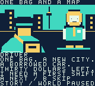
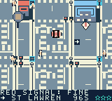

# Toronto Dispatch

A north-up, top-down pixel-art courier sandbox for ModRetro Chromatic / Game Boy Color. Deliver timed jobs through seven compressed Toronto districts: drive with momentum and braking, park and walk to clients, or pay for scheduled transit to take a shortcut.

 

Original 160 × 144 frames from the selected R6 ROM. The [native record](docs/NATIVE_STORY_COMBAT.json) binds their frame numbers and checksums.

## Play and install

Use the [Chromatic loading guide](docs/LOADING.md). The selected build is **`toronto-dispatch-story-combat-r6.gbc`**, 1,048,576 bytes, SHA-256 `71a7e49363947d4f036300770e1b24da4a3df80e344bfe41675c74240bfbf2b8`. [Official compilation](docs/STORY_COMBAT_BUILD.json), four compiled guards, full `make check` and [scoped native play](docs/NATIVE_STORY_COMBAT.json) pass. Select that raw ROM locally; a new source-pinned ZIP awaits the source commit and package audit. Cartridge write and physical cold boot remain pending. Generated binaries stay outside Git.

The last physically confirmed baseline is **`toronto-dispatch-hardware-feedback.gbc`**, SHA-256 `9c155a70c0cc3d6ccec986fc0ab7ddc3a204fd04e80879ad0233926156d4b10e`. Its [user-requested retry](docs/CARTRIDGE_UPDATE_HARDWARE_FEEDBACK_RETRY_2026_10_04.json) completed with vendor-reported success and a closed writer. No complete cartridge read-back digest was supplied. The user confirmed that ROM cold-boots with USB disconnected and responds to physical buttons; extended physical gameplay remains pending. The [first failed attempt](docs/CARTRIDGE_UPDATE_HARDWARE_FEEDBACK_2026_10_04.json), prior 8be1 [installation](docs/CARTRIDGE_INSTALL_2026_10_04.json), reviewed ZIPs and earlier 7ab sixteen-job evidence remain preserved separately. The retry followed explicit reconnection/request rather than an automatic write.

The preserved baseline cartridge bundle is **`project/build/toronto-dispatch-hardware-feedback-reviewed.zip`**. Its [independent package check](docs/HARDWARE_FEEDBACK_PACKAGE.json) verifies the exact ROM, committed source, checksums, loading instructions and licences.

The controls below describe R6, including story chapters, road guidance, health and on-foot combat. The older sandbox-stable build and installed 9c155 baseline keep their own evidence.

| Action | Controls |
| --- | --- |
| Drive | A accelerates; left/right steer while moving; B brakes and then reverses near rest. Cars can mount sidewalks |
| Park and walk | Stop, then Start → Get out of car; D-pad walks. On foot, A or B enters a nearby parked vehicle |
| Take a street vehicle | On foot, approach a parked car or occupied road vehicle and press A or B; an occupied vehicle shows its driver being dragged out before entry |
| Enter a shop | On foot, A at a marked doorway opens a separate grocery, corner-store or repair-shop room. D-pad walks; A talks to the keeper; B leaves, or walk through the bottom doorway. Start explains how to leave for the menu |
| Restore health / ammo | If supplies are needed, A near a shopkeeper spends $10 for up to 25 health and at least 12 rounds; entry displays the price |
| Fire on foot | B fires in your walking direction when a nearby vehicle or TTC interaction does not take priority. Each fresh shot uses one round and increases police attention |
| Read the story | A advances a dialogue page; B or Start skips the current chapter. The world and delivery clock pause during dialogue |
| Use a boat | On foot, A near a launch at a Core/Port Lands dock boards. A accelerates, left/right steer, B brakes/reverses. Stop near a dock, hold Down and press A to get out |
| Choose a vehicle | Start → Change vehicle, while stopped in your vehicle, with no active job |
| Plan a quest | Without active work, Select opens dispatch; during work use Start → Jobs. Select jumps chapters, left/right selects offers, up/down browses stops; A accepts or resumes, B returns |
| Collect / hand off | Select at each ordered marker; returning jobs finish at their final stop |
| Take transit | On foot, B at a station/terminal/platform, away from nearby cars; left/right selects, A waits/boards. At Wellesley, up switches train/bus |
| Browse the map | Start → Select, or Start → City Map; D-pad pans, A centres job/booked stop/depot, Select changes focus, B returns |
| Pause / resume | Start opens the main menu. Choose Resume with A, or press B/Start from the main menu to continue |
| Save Game | While roaming, Start → Save Game → A saves progress and returns to the street; transit saves automatically |
| Change sound | Start → Settings → Sound; A cycles Music + Effects, Effects Only and All Sound Off |
| Review controls | Start → Settings → Control Guide; A/B returns to Settings |

Hold up/down to browse the main menu or Settings; A selects once. Settings has Sound, Control Guide and Back. Back, B or Start returns from Settings to the main menu; A/B returns from the guide to Settings. The Pause footer explains unavailable car, recovery and TTC actions. Menus freeze the world and delivery clock, including while waiting for or riding transit. Shops remain live; press B to leave before using Start for Save or Settings. Sound choices last for the current session and reset when the game boots. Release menu-used A/B before pressing them again to accelerate, brake or fire.

A slim bottom HUD shows the objective arrow and remaining time during jobs, or street and cash while roaming, with up to three police stars. On foot, health and ammunition stay visible, including during notices. A small road arrow guides the next part of your single active contract; the beacon and map remain available. Notices and transit temporarily expand the HUD; the full-screen pause menu and atlas provide details. Hold directions to browse jobs and transit. A delivery result's A opens dispatch, with an unseen story chapter first when eligible. Review every stop before accepting; arrival alone does not advance the job, so press Select at the marker. Active previews show CURRENT STOP and A resumes the existing job. An eligible incomplete vehicle-specific offer shows WRONG VEHICLE until you occupy the required vehicle.

Mainland vehicles remain parked during transit and Island walking. Trains cost $3, buses $2, Queen streetcars $3 and ferries $4 in game money. Freight and passenger jobs require driving; attempts to use transit display DRIVE FOR THIS JOB. WAIT can be cancelled with B without abandoning the contract or paying a fare. Menus pause the clock; waiting, riding and time inside shops use delivery time. Island offers show $8/$16/$24 required ferry budgets, with extra cash needed for optional travel and fines. If an active Island job cannot fund the return, use Start → Cancel Job, then B at the dock for scheduled $0 assistance. Abandoning pays nothing and earns no completion.

## City and jobs

Explore compressed Core, western neighbourhoods, High Park/Junction, eastern neighbourhoods, Port Lands, public Islands and Uptown Hills. The game contains **344 buildings, 657 pedestrian routes, 104 contracts, 64 service points and nine mainland parking anchors**. Four player vehicles, wide roads and sidewalks, varied original buildings, roof/canopy occlusion, walking/car entry, a scrollable atlas, original chiptune music and saved progression are implemented. Bright park foliage, turquoise water, striped crossings, bus poles, parking bays/lots and varied brick, glass, civic and warehouse details make each district easier to read. The [city art and shop record](docs/CITY_ART_AND_SHOPS_2026_10_04.md) describes the original artwork, three native shop levels and bounded geographic audit.

Eight job types cover parcel rounds, fragile art, express files, truck freight, transit relays, passenger rides, ordered returns and Island post. Cargo starts after pickup; damage reduces the base payment, while remaining time adds a bonus. Fast steering also reduces passenger comfort. Port Lands routes use Leslie access and authored bridges; Island deliveries use ferries and public walking paths. North includes railway underpasses, foot-only Baldwin Steps and public Casa Loma/Rosehill handoffs.

Eight road vehicle identities include cars, taxis, trucks, buses, police, ambulance and fire vehicles, following their lanes, queues and fictional red/green signals. Ordinary drivers yield to the visible walking courier; pursuing police remain dangerous. Varied human pedestrians arrive from outside the camera, walk and pause to converse; original helmeted workers near the fictional FIRE garage supply ambient fire crew activity. Parked cars and occupied street vehicles can be taken with a quick A/B interaction. The approved courier and pedestrian artwork is retained.

Cars keep momentum through steering and cannot spin at rest. Vehicle collisions transfer momentum according to relative approach speed and vehicle weight: a faster rear impact can push a slower vehicle, while a head-on or heavier-body impact produces stronger recoil. Street fences, poles, signs, bins, benches and other registered furniture break with a brief flash/falling-fragment animation and leave rubble. Buildings, solid tree bases and the shoreline retain their structural collision.

Driving into a pedestrian slows the car and shows non-graphic flight and a prone body, with carried-cargo damage, escalating fines and police pursuit. Vehicles can knock down the walking courier. The courier has separate health and ammunition: walls and nearer vehicles block shots. At one star, arrest charges up to $25 and briefly holds the courier in a normal pose. At two/three stars, armed police fire with greater damage and pursue faster; close captures retain $100/$225 penalties. Wanted stars blink while cooling; stay outside patrol/helicopter observation for 30 active game seconds per level to escape. Shops and roof/bridge cover can help break observation, while delivery deadlines continue.

Zero health sends the courier to a fictional Toronto General forecourt in Core after a short downed period. Look for the original mint medical badge east of University and south of College. Hospital recovery restores 100 health and 12 rounds, clears police attention, charges up to $40 and fails active work once. Your car remains parked where you left it. R6's native sample verifies Core recovery and one-star arrest; transitions from all seven districts and fatal-job overlap have host checks. Cartridge checks remain pending.

Planes and helicopters fly into view, with occasional larger jet shadows crossing the ground; increased police attention can bring a pursuing helicopter. Larger boats show occupants and animated wakes, with a controllable launch and boarding and safe dock exits in Core and Port Lands. Boats travel beneath the supported bridge decks; road vehicles remain parked while the courier takes a boat. Shops are genuine separate playable rooms. Borrowed fleet identities, boat motion, displaced traffic and destroyed furniture use transient session state; a cold reload restores safe courier progress and intact scenery.

The existing original 8-bit City Shift song plays alongside engine pitches, braking noise and impact, pickup, delivery, transit and menu cues. Settings chooses which sounds play; physical listening and speaker/headphone quality still need review.

The story follows a newcomer with a borrowed car, rent to pay and a first shift, through friendships, a rival's scheme and a community courier business. Eight original over-the-shoulder chapters contain 41 pages and become eligible at 0, 1, 8, 16, 32, 56, 80 and 104 unique deliveries. Welcome opens the introduction; later delivery results queue one unseen chapter at a time. Save v11 keeps the same 58-byte payload and adds saved health, ammo and chapter flags while migrating older v4–v10 career layouts. The existing 45 courier poses remain intact, with four original sidearm poses appended; city art and the north-up camera stay unchanged.

Visible road traffic and paid transit schedules use separate game abstractions. Geography is a researched compression of Old Toronto, the waterfront and public Islands; service times/fares, courier handoffs, fire garage, shops and parking courts are fictional game design. Native samples cover selected sandbox features; broader play and physical verification remain open.

## Verification and remaining work

R6's [build record](docs/STORY_COMBAT_BUILD.json) binds 243 unchanged native inputs and matching debug artifacts. Linked static reserve is 548 bytes, fixed HOME has 207 bytes free and scenes peak at 124/128 OBJ tiles per bank. These checks establish allocation limits, not deepest stack use.

The [fresh R6 native run](docs/NATIVE_STORY_COMBAT.json) ends passed at frame 12,974 without imported progress or game-memory writes. It completes the first job at full condition for $129, checks introduction/first-pay dialogue freezing and skipping, sees the arrow in 30/30 sampled views, cycles all three sound settings and freezes the map. Three fresh shots and a held-button check lead to H3 injury, a prone pose and hospital recovery at `(504,344)`: cash $129→$89, health 100 and ammo 12, with the parked car unchanged. Two $25 H1 arrests, blocked firing during arrest and genuine explicit/automatic-save resets preserve the checked career, hospital position, health, ammo and story flags.

Actual-C host checks cover all 107 route goals, later chapter thresholds, all seven hospital transitions, fatal-job overlap, blocked exits, failed scene queues and interrupted SRAM journal commits. Native hospital play starts and ends in Core; later chapters and other district recoveries have not been played in R6.

Navigation's ROM prefix counts reduce counted mask-ordinal byte operations by 79.72%; an exact 14-byte cache avoids repeated same-cell work. The retained ground-patch correction uses no extra guidance RAM. [R6 optimization evidence](docs/STORY_COMBAT_OPTIMIZATION.json) counts 149 idle and 160 active updates in separate 840-VBlank samples, roughly 10.64/11.43 completed loops per emulated second. These scoped observations do not establish FPS gains or whole-city smoothness. [PERFORMANCE.md](docs/PERFORMANCE.md) preserves the R5 arrow finding separately; no population, graphical detail or existing gameplay rule was reduced for speed.

Retained sandbox-stable `096862abfd1e1fa7d5ceb6dc6d808b08a580ac9dc5b33d428e4f97d297eee45b` keeps its [200-input build](docs/SANDBOX_STABLE_BUILD.json), [30,153-frame native scope](docs/NATIVE_SANDBOX_STABLE.json), [579-byte reserve](docs/SANDBOX_STABLE_OPTIMIZATION.json) and [reviewed R2 package](docs/SANDBOX_STABLE_PACKAGE_R2.json). Its native reset checks completed partial car entry; R6 retains the host-covered fix without replaying that native branch. The failed `668727…` [corruption diagnostic](docs/NATIVE_SANDBOX_STACK_DIAGNOSTIC.json) remains ineligible.

The retained 9c155 baseline passed official compilation, full `make check` and [compiled resource/memory checks](docs/HARDWARE_FEEDBACK_BUILD.json). Its [fresh native run](docs/NATIVE_HARDWARE_FEEDBACK.json) completes Market Start at full condition, verifies stable cardinal driving, walking/car entry, airborne/prone humans, menu repeat/map freeze, one paid Queen trip, tram knockback/recovery and committed in-worker reset. Crowded OAM samples stay within hardware limits; physical flicker remains unverified on this update. The retained 8be1 four-job record and its physical installation retain their own identities.

Separate genuine checkpoint continuations on retained 7ab reach **16 distinct completions**, representing all eight job types. [Passenger checks](docs/NATIVE_PASSENGER_CONTINUATION.json) cover vehicle/transit restrictions and slow/fast steering comfort. [North checks](docs/NATIVE_NORTH_CURRENT_CONTINUATION.json) add three jobs, underpass driving, foot delivery and original-car recovery. [Relay/Island checks](docs/NATIVE_RELAY_ISLAND_CURRENT_CONTINUATION.json) add two jobs, nine paid rides, unpaid-WAIT cancellation, public bridge walking, map panning/freezing, original-motorcycle recovery and committed in-worker reset. [East/Port checks](docs/NATIVE_EAST_PORT_CURRENT_CONTINUATION.json) add a full-condition motorcycle round through Riverside and Danforth, then required-truck freight through Leslie to the Channel apron. Cumulative recordings include source-loaded scenes from all seven districts. Imported completions are retained as ancestry, rather than counted as newly played in each continuation.

The [testing record](TESTING.md) preserves exact build identities, older evidence, failed attempts and controller corrections. Motorcycle job 74 previously finished with one second left and needs replay at the slower speed; all 104 deadlines are unchanged. Full 104-contract play, two measured enjoyable human hours, broader handling/reward/deadline tuning, older-save imports, deepest stack/whole-city performance, browser recovery and this build's cartridge write/cold boot/save/audio/flicker checks remain pending. Emulator reset verifies committed in-worker progress, rather than physical battery persistence or every latest live field.

## Develop

Select `project/project.gbsproj` with the ModRetro Chromatic plugin. Read [DESIGN.md](DESIGN.md), [DECISIONS.md](DECISIONS.md) and [ROADMAP.md](ROADMAP.md) before changing gameplay; follow [BUILD.md](docs/BUILD.md) and run `make check` from the repository root. Original code/art are MIT licensed; [distribution notices](docs/DISTRIBUTION.md) retain upstream terms.
