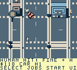
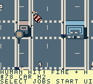
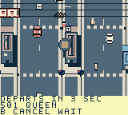
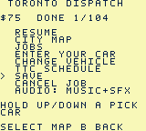

# Hardware feedback update — 2026-10-04

The user played the installed `8be1…` cartridge and requested slower, steadier
driving and trams, smaller varied pedestrians, airborne/prone impacts, a clearer
car, on-foot vehicle injuries, easier menus and richer scenery.

The distinct tested update is **`project/build/toronto-dispatch-hardware-feedback.gbc`**,
**1,048,576 bytes**, SHA-256
**`9c155a70c0cc3d6ccec986fc0ab7ddc3a204fd04e80879ad0233926156d4b10e`**.
The prior ROM file and reviewed ZIP remain unchanged. The
[first cartridge write](CARTRIDGE_UPDATE_HARDWARE_FEEDBACK_2026_10_04.json)
failed and its writer closed. After reconnection and an explicit retry request,
the [second write](CARTRIDGE_UPDATE_HARDWARE_FEEDBACK_RETRY_2026_10_04.json)
completed with vendor-reported success in 52,404 ms. No automatic plugin retry
was dispatched. The user then confirmed cold boot with USB disconnected and physical button response. Complete read-back and extended physical gameplay remain unverified.

The reviewed local ZIP is **155,795 bytes**, SHA-256
**`9dd43b59841a2bc5dba399ba88722fabddff1f835f05d32d0048e13628d9b570`**,
with source **`538e504453d009ec6246ceca80e8639776ba91d9`**. Its
[independent package check](HARDWARE_FEEDBACK_PACKAGE.json) verifies the exact ROM,
173 committed build-input pins, checksums, frozen guide and licences. Binaries
remain local and ignored; this is separate from a GitHub binary release.

## What changed

| Area | Result |
| --- | --- |
| Driving | Car/truck/motorcycle/scooter maximum Q4 speeds are 14/12/16/10, down from 24/20/28/18. Braking, reverse and momentum remain. Traction now settles the final velocity unit, eliminating persistent sideways drift at cardinal headings; steering uses a slower regular cadence. |
| Queen tram | Fictional cycle is 256 game seconds, with 16 seconds per hop and four-second door dwells. Maximum authored track speed is about 57 pixels per game second, down from 342. Paid timetable and visible tram share this schedule; the $3 fare is unchanged. |
| Car and courier | Larger 15×11 cardinal car silhouette with windows, hood and lamps; matching seven-pixel collision half extent. Walking courier occupies one sprite object and retains visible exit/entry. |
| People | Four original types: commuter, hardhat worker, backpacker and cane-carrying senior. Normal silhouettes are 6×10 pixels. Each type has walking, airborne and prone poses. |
| Pedestrian impact | Up to 12 pixels of terrain-clipped knockback over 24 simulation ticks, then a prone/dead pose. Local route IDs stay dead until district loading/reset, including when a visual slot is reused. Grounded bodies do not cause repeated fines. |
| Courier impact | Moving road vehicles can knock the walking courier up to 24 pixels, followed by 72 simulation ticks of recovery and temporary immunity. Carried cargo can lose condition; a fresh courier can get up and keep roaming. The tram retains its separate step-clear contact response. |
| Sprite rendering | Stable player-first order, signed edge clipping and whole-pose admission within 40 objects/10 per scanline. Offscreen objects no longer consume visible line capacity. Busy scenes may omit lower-priority whole poses. |
| Menus | Shorter context-sensitive labels, held directional navigation and Start → Select for the map. A/B actions remain consumed until release. |
| Scenery | 375 original roof modules and 758 street/park props, including benches, planters, signs, bins, bollards and industrial crates. Clearer signal heads use existing dynamic tiles. Existing 344 building footprints, roads, entrances, collision and canopy geometry are preserved. |

Nominal driving speeds assume 60 active simulation ticks per game second; they
are not a physical frame-rate measurement. All 104 contract deadlines remain
unchanged. An independent shortest-route model leaves positive nominal slack
for every contract, but excludes traffic, steering and entry time. In particular,
motorcycle job 74 previously finished with only one second left on an older ROM;
it still needs a native replay and human balance review with the slower vehicle.
Queen travel is optional, and its longer wait can exceed short quest deadlines.
The route screen shows the wait and ride before booking; B cancels unpaid WAIT.

## What is verified

The official source-debug native build succeeds in 67,663 ms. The initial build
exceeded fixed bank 0 by 85 bytes; moving per-actor rendering into a banked helper
resolved it. A diagnostic second ROM is retained separately because civilian
frame metadata was repaired during that build. Final `9c155…` includes the repair.

[Build evidence](HARDWARE_FEEDBACK_BUILD.json) records matching source/debug hashes,
valid CGB-only MBC5/battery header, compiled artwork/table guards and 1,046 bytes
of linked static reserve. Civilian poses compile to one object, with ten allocated
tiles in each bank. Combined scene OBJ allocation peaks at 120/128 per bank.
All seven background source graphics pass palette/tile checks. Static reserve
and tile allocation do not measure the deepest stack or whole-city performance.

Full `make check` passes, including real production C with sanitizer checks for
motion, walking/vehicle impacts, pedestrian death identity, transit scheduling,
menus, clipping, traffic, terrain equivalence, UI and district navigation.

The [fresh native record](NATIVE_HARDWARE_FEEDBACK.json) uses ordinary buttons and
read-only inspection, with no checkpoint/SRAM imports or game-memory writes:

- Market Start completes at condition 100 with 111 seconds left, paying $108 and
  leaving $138/one completion. East/south/west/north straight runs retain their
  settled orthogonal coordinate at car speed 14. Braking, reverse and recovery
  from an incorrectly planned northwest drive are retained.
- Exit, walking, intermediate entry and occupied-car poses are observed. Four
  pedestrian types fit their native poses; recorded impacts show airborne and
  prone humans, with fines and police attention. The images establish rendering,
  rather than a measured world-space throw distance.
- Held Down reaches Pause row 3 after 40 frames and Save row 6 after 64. Start →
  Select opens the map; two in-map intervals preserve all 58 state bytes,
  including an unpaid Queen booking.
- Queen Yonge → Queen Broadview waits, charges $3 exactly once and arrives on
  foot with the original car still parked. Scheduled departure/arrival are game
  seconds 48/64; arrival is observed at 66. A later returning tram naturally
  pushes the standing courier from X970 to X942, shows airborne/prone poses and
  allows walking after recovery. No carried job is active for that impact.
- Explicit Save followed by a genuine four-button in-worker reset restores
  $75/one completion, walking pose and parked-car identity. Committed subsecond
  42 restores, rather than the later live subsecond 59. This is separate from
  physical battery persistence.
- The busiest sampled OAM frame has 17 visible objects, a peak of seven per
  scanline and zero over-limit lines. Other ride/reset samples peak at five.

These are byte-original 160×144 native frames from this ROM. Public JSON retains
their PNG/RGBA hashes, selected semantic observations, every completed input
step and controller corrections. The full original journal is stopped, closed,
archived and retrieved; private logs, saves and generated binaries remain ignored.

## Remaining checks and limitations

Physical flicker, handling, slower tram appearance, save persistence and audio
need the user's new cartridge session. The retry has vendor-reported installation
evidence and user-confirmed cold boot/buttons; extended physical gameplay remains pending.
Road-NPC impacts on the courier are covered by the actual-C host fixture; the
native injury sample above uses the tram. All 104 contracts, two measured enjoyable
human hours, wider vehicle/deadline tuning, older-save imports and deepest-stack/
performance measurements remain pending.

The existing partial-entry save overlap is still pending: near the parked car,
A finishes entering and recovers movement. Avoid saving during entry. A read-only
review also finds a roughly one-pixel NPC avoidance mismatch beside the wider
parked car; this can cause a small artwork overlap and remains separate work.
Pedestrian deaths reset when the district reloads and are not saved body state.
